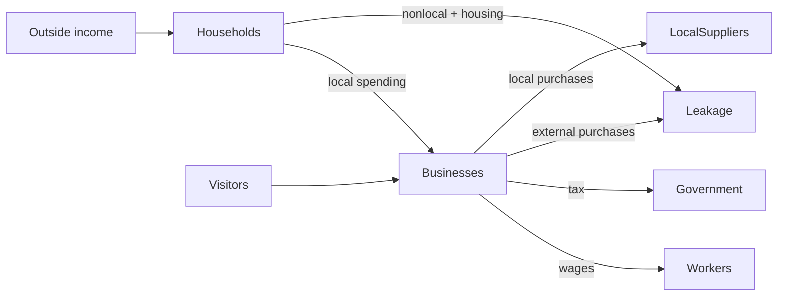

# Chapter 1 — What Is a Regional Economy?

Around Williamsburg and the Historic Triangle, a visitor may pay for a room, a household may buy
dinner, a shop may pay an employee, and government may collect tax. A **regional economy** is the
connected system formed by those decisions within a chosen boundary—not merely a list of firms.
Our small fictional case makes those connections visible.

Households receive external or wage income, pay housing, shop locally or elsewhere, and retain
funds. Tourism/hospitality, retail, and food-service businesses receive local customer revenue and
use it for wages, purchases, tax, and retention. Visitors bring external spending. Government
collects simplified sales and lodging taxes. **Classified external outflows** identify only the
completed exits currently captured; they are not a complete regional ledger.

## Baseline walkthrough

Run `regional-sim run baseline`. `MonthStarted` precedes external household income and visitors.
Household allocation then completes; combined household and visitor customer payments become
sector demand; capacity- and supply-served demand becomes recorded business revenue; wages and taxes
follow. `MonthCompleted` reports implemented allocation and transfer checks.
The dashboard distinguishes population context, external inflows, unique customer revenue, later
uses, ending positions, classified external outflows, and recorded business revenue. Revenue is not an ending local cash
balance, and wages are not added to revenue to manufacture a larger activity number.

## Debugging laboratory

Use the safe, opt-in fixture specified in **Debugging laboratory contract** below. The fault is learner-owned and deterministic; do not edit production simulation logic.

## Scenario experiment

Copy `baseline.yml`, change one household sector share while preserving a total of one, and rerun.
Which sector's revenue changes? Does total revenue change? Then raise a visitor category amount
without exceeding capacity. Predict the dashboard before running it.

## Interpretation questions

1. Which agents introduce money and which redistribute it?
2. Why is a wage both a business use and household income in a broader model?
3. Why does this one-month model avoid respending that wage?
4. Why is revenue different from retained operating funds?

## Limitations and summary

Representative groups hide household and firm diversity. There are no prices, inventories,
commuting, housing market, workforce dynamics, multiplier rounds, or forecasts. Yet the experiment
establishes inspectable subsystem allocations and one matched tax transfer. Institutional flows,
housing recipients, suppliers, and financial positions are not consolidated, so regional sources
and uses remain **NOT YET CONSOLIDATED**.

The canonical relationship diagram is [`docs/diagrams/entity-relationships.mmd`](../docs/diagrams/entity-relationships.mmd); the canonical money-flow source is [`docs/diagrams/money-flow.mmd`](../docs/diagrams/money-flow.mmd).

### Complete debugging exercise

1. **Launch configuration:** **Run Baseline Scenario**.
2. **Breakpoint:** `engine.py`, the call `business.record_and_allocate(...)`.
3. **Expected variables:** for the current `business`, `revenue_by_sector[business.sector]` equals
   household sector spending plus visitor category spending; `sales_taxes` is nonnegative.
4. **Question / incorrect behavior to inspect:** temporarily reduce that business's `monthly_capacity` below
   its revenue and observe the capacity error rather than a silent truncation.
5. **Correct behavior:** capacity is at least revenue; stepping into `record_and_allocate` records
   the complete payment and divides after-tax funds into mutually exclusive uses.
6. **Economic importance:** silently dropping demand would understate customer activity and break
   the connection between household/visitor payments and business receipts.

## Auditing a transaction path

The monthly model preserves customer-source identity through a canonical transaction pipeline. A reduction belongs to the single transition where it occurs, preventing the same unrealized demand from being described twice.

## Debugging laboratory contract

- **Goal:** distinguish a deliberately inconsistent transaction-stage identity from its corrected form without editing the engine.
- **Launch configuration:** **Chapter 01 — Inspect Regional Flow**.
- **Scenario:** the bundled scenario named by this chapter's executable walkthrough; the shared helper itself uses fixed learner-owned values.
- **Breakpoint:** place a semantic breakpoint inside `inspect_stage_identity()` immediately before `StageIdentityObservation` is returned.
- **Objects to inspect:** `configured_demand`, `recorded_business_revenue`, `constrained_amount`, and `identity_holds`.
- **Expected fault:** the opt-in faulty observation records revenue plus constrained demand that does not equal configured demand.
- **Reconciliation or indicator effect:** `identity_holds` is false; normal simulation results are untouched.
- **Fix:** rerun with `faulty=False`; do not edit production allocation logic.
- **Economic meaning:** constrained or interrupted demand is neither spending nor an external outflow, so it cannot be added to recorded revenue inconsistently.
- **Verification:** run `python -m regional_economy.debug_labs` and `pytest tests/test_debug_labs.py`.

## Scenario experiment checklist

Change no more than two documented assumptions in a copied scenario. Ask: **what changed, why did it change, what did not change, and what boundary limitation remains?** Separate modeled results from recommendations and identify who benefits, who bears a constraint, and whether each quantity is a flow, stock, or unmet amount.

## Assumptions and limitations

All values are deterministic fictional educational assumptions. The model implements selected subsystem allocation and transfer reconciliations, not a complete regional sources-and-uses account or a forecast.
