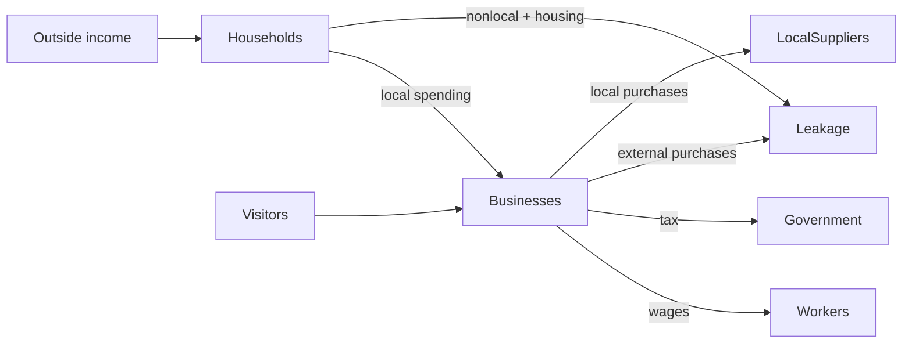

# Chapter 1 — What Is a Regional Economy?

Around Williamsburg and the Historic Triangle, a visitor may pay for a room, a household may buy
dinner, a shop may pay an employee, and government may collect tax. A **regional economy** is the
connected system formed by those decisions within a chosen boundary—not merely a list of firms.
Our small fictional case makes those connections visible.

Households receive external or wage income, pay housing, shop locally or elsewhere, and retain
funds. Tourism/hospitality, retail, and food-service businesses receive local customer revenue and
use it for wages, purchases, tax, and retention. Visitors bring external spending. Government
collects simplified sales and lodging taxes. **Leakage** identifies modeled money sent outside.

## Baseline walkthrough

Run `regional-sim baseline`. `MonthStarted` precedes external household income and visitors.
Household allocation then completes; combined household and visitor customer payments become
business revenue; wages and taxes follow; `MonthCompleted` reports a zero reconciliation difference.
The dashboard distinguishes population context, external inflows, unique customer revenue, later
uses, retained balances, leakage, and simulated local activity. Revenue is not an ending local cash
balance, and wages are not added to revenue to manufacture a larger activity number.

## Debugging laboratory

Break in `run_scenario` at `business.record_and_allocate(...)`. Inspect `household_by_sector`, the
visitor's `spending_by_category`, and `revenue_by_sector`. Verify for each sector that household plus
visitor spending becomes exactly the recorded customer revenue. Step into the business method and
watch that flow split into taxes and operating uses.

## Scenario experiment

Copy `baseline.yml`, change one household sector share while preserving a total of one, and rerun.
Which sector's revenue changes? Does total revenue change? Then raise a visitor category amount
without exceeding capacity. Predict the dashboard before running it.

## Interpretation questions

1. Which agents introduce money and which redistribute it?
2. Why is a wage both a business use and household income in a broader model?
3. Why does this one-month model avoid respending that wage?
4. Why is revenue different from retained operating funds?

## Limitations and summary

Representative groups hide household and firm diversity. There are no prices, inventories,
commuting, housing market, workforce dynamics, multiplier rounds, or forecasts. Yet the experiment
establishes the essential system: outside inflows become customer transactions, then explicit uses,
with leakage and retention visible and every cent reconciled.

The canonical relationship diagram is [`docs/diagrams/entity-relationships.mmd`](../docs/diagrams/entity-relationships.mmd); the canonical money-flow source is [`docs/diagrams/money-flow.mmd`](../docs/diagrams/money-flow.mmd).

### Complete debugging exercise

1. **Breakpoint:** `engine.py`, the call `business.record_and_allocate(...)`.
2. **Expected variables:** for the current `business`, `revenue_by_sector[business.sector]` equals
   household sector spending plus visitor category spending; `sales_taxes` is nonnegative.
3. **Incorrect behavior to inspect:** temporarily reduce that business's `monthly_capacity` below
   its revenue and observe the capacity error rather than a silent truncation.
4. **Correct behavior:** capacity is at least revenue; stepping into `record_and_allocate` records
   the complete payment and divides after-tax funds into mutually exclusive uses.
5. **Economic importance:** silently dropping demand would understate customer activity and break
   the connection between household/visitor payments and business receipts.
