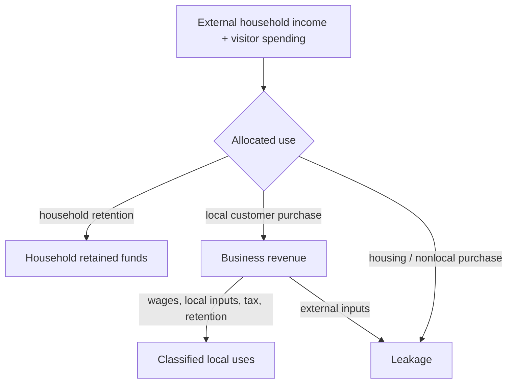

# Chapter 2 — Where Money Enters and Leaves

External household income and visitor spending are this model's two entry channels. What happens
next depends on **local retention**: households choose local rather than nonlocal purchases, and
businesses choose local rather than external inputs. An import is represented by an external
purchase. Housing paid outside the modeled business set, household nonlocal spending, and business
external purchases are leakage.

## Equal inflows, different retention

Imagine two copied scenarios with equal income and visitors. In one, households allocate 65% of
post-housing funds locally; in the other, 55%, with the ten points moved to nonlocal spending.
Sources are equal, but the second scenario produces less business revenue and more household
leakage. Similarly, shifting a business allocation from external to local purchases leaves its
revenue unchanged while lowering business leakage. Share groups must always remain exactly one.

## Baseline and tourism season

Run `regional-sim compare baseline tourism-season`. The fictional season has more visitors,
category spending, capacity, seasonal household income, wage share, and local business purchasing
relative to external purchasing. The comparison reports changes in visitor spending, revenue,
wages, taxes, leakage, and unique local activity. A larger leakage total can coexist with a better
retention *rate* when total inflow is much larger; compare both level and proportion.

## Debugging laboratory

Break after `external_purchases` is calculated in `run_scenario`. Select one business and trace its
integer-cent revenue through tax, operating amount, and `external_purchases`. Confirm that amount is
included once in `economic_leakage`, included among reconciliation uses, and absent from wages,
local purchases, and retained business funds. Repeat with `household_nonlocal`.

## Interpretation questions

1. Can revenue rise while retained business funds fall?
2. Which configured share changes household leakage without changing external inflow?
3. Why are local business purchases not added to simulated activity?
4. How would misleading conclusions arise from comparing leakage levels alone?

## Limitations and summary

The boundary treatment is simplified: all housing leaves, all modeled local purchases remain, and
there are no supplier rounds or empirical import propensities. The scenarios are fictional, not
Williamsburg measurements. Still, the lesson is testable: identical inflows can have different
regional consequences because retention assumptions control how quickly money leaves, and explicit
reconciliation prevents leakage from also masquerading as retained money.

See the canonical [`docs/diagrams/money-flow.mmd`](../docs/diagrams/money-flow.mmd) and
[`docs/diagrams/event-ordering.mmd`](../docs/diagrams/event-ordering.mmd) sources.

### Complete debugging exercise

1. **Breakpoint:** `engine.py`, the line `leakage = housing + household_nonlocal + external_purchases`.
2. **Expected variables:** all three components are integer cents and their sum equals
   `metrics.economic_leakage` after construction.
3. **Incorrect behavior to inspect:** temporarily omit `external_purchases` from the expression;
   leakage becomes too small while final uses still contain the external payment.
4. **Correct behavior:** leakage includes each boundary exit exactly once, while reconciliation uses
   still classify every cent and finish at zero.
5. **Economic importance:** omitted imports exaggerate local retention even when the books happen
   to reconcile through a separately classified use.
