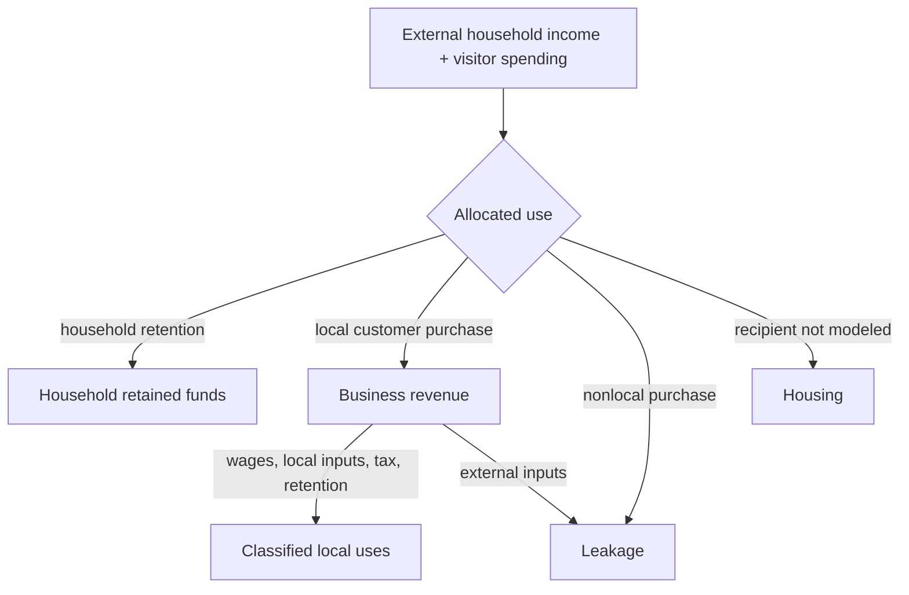

# Chapter 2 — Where Money Enters and Leaves

External household income and visitor spending are two canonical entry indicators; other configured
funding values can remain descriptive. What happens
next depends on **local retention**: households choose local rather than nonlocal purchases, and
businesses choose local rather than external inputs. An import is represented by an external
purchase. Housing is a completed cash use whose recipient is not modeled. Classified external
outflows include deductions outside the local-government flow, household nonlocal spending,
business external purchases, and university external procurement.

## Equal inflows, different retention

Imagine two copied scenarios with equal income and visitors. In one, households allocate 65% of
post-housing funds locally; in the other, 55%, with the ten points moved to nonlocal spending.
Sources are equal, but the second scenario produces less business revenue and more household
leakage. Similarly, shifting a business allocation from external to local purchases leaves its
revenue unchanged while lowering business leakage. Share groups must always remain exactly one.

## Baseline and tourism season

Run `regional-sim compare baseline tourism-season`. The fictional season has more visitors,
category spending, capacity, seasonal household income, wage share, and local business purchasing
relative to external purchasing. The comparison reports changes in visitor spending, revenue,
wages, taxes, leakage, and unique local activity. A larger leakage total can coexist with a better
retention *rate* when total inflow is much larger; compare both level and proportion.

## Debugging laboratory

Select **Run Tourism-Season Scenario** and break after `external_purchases` is calculated in `run_scenario`. Select one business and trace its
integer-cent revenue through tax, operating amount, and `external_purchases`. Confirm that amount is
included once in `economic_leakage`, included among reconciliation uses, and absent from wages,
local purchases, and retained business funds. Repeat with `household_nonlocal`.

## Interpretation questions

1. Can revenue rise while retained business funds fall?
2. Which configured share changes household leakage without changing external inflow?
3. Why are local business purchases not added to simulated activity?
4. How would misleading conclusions arise from comparing leakage levels alone?

## Limitations and summary

Housing destination, supplier receipts, institutional payroll recipients, and healthcare external
procurement are not consolidated. Deposits, credit, and reserves are positions/capacity; unmet and
interrupted amounts are not spending. Allocation and tax-transfer checks remain testable, while
regional sources and uses truthfully remain **NOT YET CONSOLIDATED**.

See the canonical [`docs/diagrams/money-flow.mmd`](../docs/diagrams/money-flow.mmd) and
[`docs/diagrams/event-ordering.mmd`](../docs/diagrams/event-ordering.mmd) sources.

### Complete debugging exercise

1. **Launch configuration:** **Run Tourism-Season Scenario**.
2. **Breakpoint:** `engine.py`, the `RegionalMetrics(...)` construction.
3. **Expected variables:** deductions, household nonlocal spending, business external procurement,
   and university external procurement sum to `metrics.economic_leakage`.
4. **Question / incorrect behavior to inspect:** temporarily omit `external_purchases` from the expression;
   leakage becomes too small while final uses still contain the external payment.
5. **Correct behavior:** the compatibility total includes each currently classified exit once;
   housing and descriptive healthcare/tourism values remain disclosed omissions.
6. **Economic importance:** omitted imports exaggerate local retention even when the books happen
   to reconcile through a separately classified use.

## Canonical source records

Visitor demand is one named source in the shared transaction records and sector allocation. Tourism category attribution and lodging-tax reconciliation remain separate work; these records establish the basis for that correction without counting visitor demand twice.
