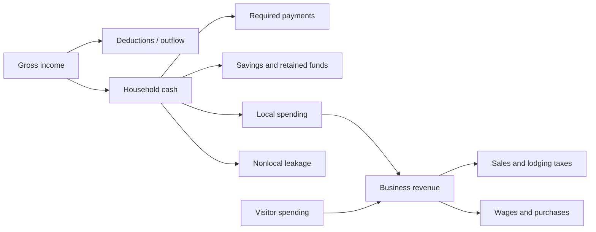
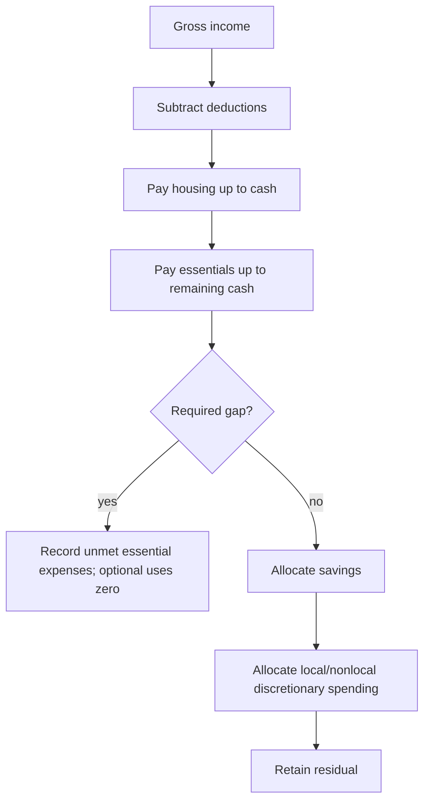

# Chapter 3 — Households, Income, and Spending

## 1. A Williamsburg-based story

Imagine six fictional groups of households planning one month near Williamsburg. A renter, a homeowner, a retiree, and a remote worker may receive different incomes and face different required costs. This laboratory does **not** claim those invented households describe Williamsburg. It asks a narrower systems question: how does household cash become—or fail to become—regional activity?

## 2. Learning objectives

After this chapter, you can distinguish gross and after-tax income; required and discretionary expenses; spending, saving, retention, and unmet expenses; local spending and leakage; and interpret educational cost-burden indicators. You can also use a reconciliation to find overspending.

## 3. Gross income is not disposable income

Gross income is cash received before deductions. After-tax income is gross income less the model's combined payroll/income deduction. “Disposable income after required expenses” is after-tax cash remaining after actual housing and essential payments. It is not necessarily all spent.

## 4. Household deductions

The deduction rate is a simplified assumed combination of payroll and income deductions. Deductions leave the modeled household sector. They are neither local sales/lodging tax nor added to local-government revenue. This is not a detailed tax calculator.

## 5. Housing and essential expenses

Housing cost is a monthly input—not a rent or home-price equilibrium. Essential nonhousing cost combines categories such as food, transportation, and utilities without separately simulating those systems. Cash pays housing first, then essential nonhousing costs.

## 6. Discretionary income and spending

Only cash left after deductions and required payments can support savings and discretionary purchases. The configured discretionary rate applies to that remainder. Therefore the engine cannot spend income that is unavailable.

## 7. Savings and retained funds

Savings is an explicit target allocation of post-required cash. Retained funds are the residual not assigned to required costs, discretionary spending, or savings. Neither becomes current business revenue. No borrowing or debt fills a gap.

## 8. Local and nonlocal spending

Essential and discretionary purchases each split into local and nonlocal portions. Local spending is allocated deterministically among tourism/hospitality, retail, and food service; its total exactly equals household-derived business revenue. Nonlocal spending is leakage. Visitor revenue stays distinguishable.

## 9. Household types and unequal effects

The six fictional cohorts are lower-income renter, middle-income renter, middle-income homeowner, higher-income homeowner, retired household, and remote-worker household. Count, workers, income, required costs, savings, locality preferences, and external-income share can differ. Different constraints—not virtue or vice—produce different regional effects.

## 10. Housing-cost burden

Housing-cost burden is configured monthly housing cost divided by gross monthly income. A cohort is burdened only when the ratio is **greater than 30%**, and severely burdened only when it is **greater than 50%**. The dashboard average is household-count weighted. These assumed thresholds are educational indicators, not an official Williamsburg affordability assessment.

## 11. Financial stress and unmet expenses

“Unmet essential expenses” is configured housing plus essential nonhousing cost minus actual payments. Under pressure, deductions are applied, housing is paid up to available cash, essentials are paid from what remains, and savings and discretionary spending fall to zero. The gap is reported but is not spending, debt, or regional revenue.

## 12. System-flow diagram

## 13. Household budget diagram

## 14. Baseline walkthrough

Run `regional-sim run baseline`, then `regional-sim report household baseline`. The dashboard summarizes all cohorts; the detail table reveals which cohort produces each total. Four reconciliations should say `PASS`.

## 15. Income-growth scenario

`regional-sim run income-growth` raises fictional gross incomes by 8% while holding housing and essential costs fixed. Compare after-tax income, disposable cash, saving, discretionary demand, business revenue, tax collections, and leakage. This is a controlled assumption, not a forecast.

## 16. Cost-of-living-pressure scenario

`regional-sim run cost-of-living-pressure` raises fictional income by 1% but required costs by 18%. It demonstrates squeezed optional allocations, changed burden counts, and visible unmet expenses without inventing credit.

## 17. Scenario comparison

Run `regional-sim compare baseline income-growth` and `regional-sim compare baseline cost-of-living-pressure`. Signed changes show how household budgets alter business revenue and leakage while visitor assumptions remain fixed.

## 18. Debugging laboratory

Use **Debug Chapter 3 Household Allocation** in `.vscode/launch.json`. Place a breakpoint in `Household.allocate`, semantically just before `housing = min(...)` or before the final `HouseholdAllocation` is returned—not at a documented line number. Inspect the `lower-income-renter` cohort in `cost-of-living-pressure`.

Watch `gross`, `deductions`, `after_tax`, `housing`, `cash`, `essentials`, `savings`, `discretionary`, `retained`, and `unmet`. For a learner-created defect that calculates discretionary spending before required costs, expected incorrect behavior is that cash uses exceed gross income or required expenses appear paid despite unavailable cash. Correct order is deductions → actual housing → actual essentials → savings → discretionary spending → retained residual. **HOUSEHOLD AVAILABLE CASH** should fail for overspending; **HOUSEHOLD REQUIRED EXPENSES** may also fail if the gap is hidden. Restoring the order removes impossible spending, lowers dashboard discretionary/local revenue, and exposes shortfall. The defect matters because invented purchasing power exaggerates welfare and regional demand.

## 19. Interpretation questions

1. Why can gross income grow faster than local business revenue?
2. Which allocations remain after a required-cost shortfall?
3. Why is an unpaid bill excluded from the cash identity?
4. How can equal gross incomes create different local effects?
5. What changes when nonlocal preference rises?

## 20. Assumptions and limitations

All cohort values are fictional or assumed and monthly. Cohorts simplify varied households. The model has no borrowing, credit, eviction, homelessness, migration, dynamic housing supply, rent/price formation, workforce matching, unemployment transitions, transportation system, banking, healthcare, government-budget allocation, supply chains, shocks, or annual simulation. Essential costs merely bundle some unmodeled categories. Results are educational—not official analysis or prediction.

## 21. Summary

Income is not identical to spending. Deductions and required costs constrain cash; savings, preferences, and household characteristics determine what reaches local businesses; unmet expenses reveal stress without pretending unpaid obligations are money.

## Canonical source handoff

The accounting carried into tourism keeps demand-source labels on every cent. Household purchases are not used later to infer visitor activity, and constrained or interrupted demand is not an external outflow.

## Debugging laboratory contract

- **Goal:** distinguish a deliberately inconsistent transaction-stage identity from its corrected form without editing the engine.
- **Launch configuration:** **Chapter 03 — Debug Household Allocation**.
- **Scenario:** the bundled scenario named by this chapter's executable walkthrough; the shared helper itself uses fixed learner-owned values.
- **Breakpoint:** place a semantic breakpoint inside `inspect_stage_identity()` immediately before `StageIdentityObservation` is returned.
- **Objects to inspect:** `configured_demand`, `recorded_business_revenue`, `constrained_amount`, and `identity_holds`.
- **Expected fault:** the opt-in faulty observation records revenue plus constrained demand that does not equal configured demand.
- **Reconciliation or indicator effect:** `identity_holds` is false; normal simulation results are untouched.
- **Fix:** rerun with `faulty=False`; do not edit production allocation logic.
- **Economic meaning:** constrained or interrupted demand is neither spending nor an external outflow, so it cannot be added to recorded revenue inconsistently.
- **Verification:** run `python -m regional_economy.debug_labs` and `pytest tests/test_debug_labs.py`.

## Scenario experiment checklist

Change no more than two documented assumptions in a copied scenario. Ask: **what changed, why did it change, what did not change, and what boundary limitation remains?** Separate modeled results from recommendations and identify who benefits, who bears a constraint, and whether each quantity is a flow, stock, or unmet amount.

## Assumptions and limitations

All values are deterministic fictional educational assumptions. The model implements selected subsystem allocation and transfer reconciliations, not a complete regional sources-and-uses account or a forecast.

## Summary

Use the canonical command, inspect its named quantities, and interpret them within the stated accounting boundary.
