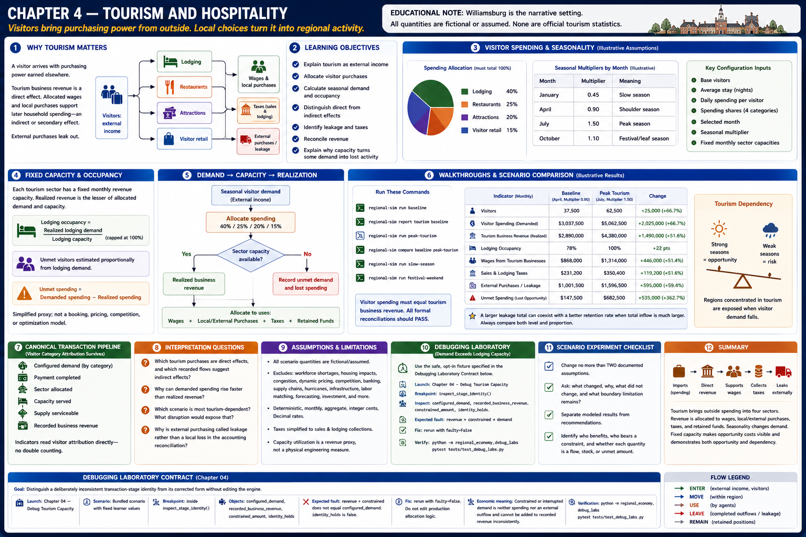
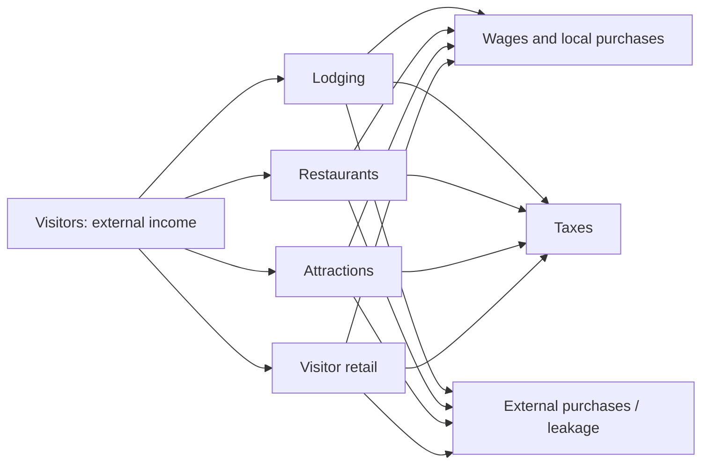
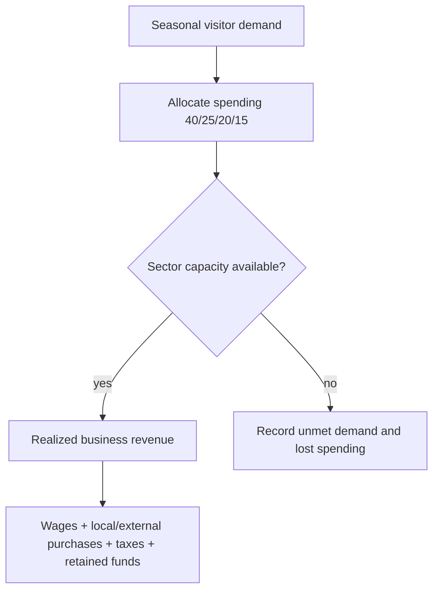

# Chapter 4 — Tourism and hospitality

> Williamsburg is the narrative setting. Every quantity in this laboratory is fictional or an explicit educational assumption; none is an official tourism statistic.

## Learning objectives

After this chapter you can explain tourism as external income, allocate visitor purchases, calculate seasonal demand and occupancy, distinguish direct from indirect effects, identify leakage and taxes, reconcile revenue, and explain why capacity turns some demand into lost activity.

## Why tourism matters

A visitor arrives with purchasing power earned elsewhere. A hotel, restaurant, attraction, or shop receives that money as **direct** revenue. Revenue allocated to local wages and purchases can support later household spending—an **indirect or secondary** effect. External purchases leak out. The model records wages transparently but does not spend them again in the same month, avoiding a fabricated multiplier.

## Visitor spending and seasonality

Configuration supplies base visitors, average stay, daily spending, four shares totaling 100%, a named month, and seasonal multipliers. The engine multiplies base demand by the selected multiplier, rounds deterministically, calculates visitor nights, and uses largest-remainder allocation for integer cents. January `0.45`, April `0.90`, July `1.50`, and October `1.10` are illustrative assumptions—not observations or forecasts.

## Fixed capacity and occupancy

Each tourism sector has a fixed monthly revenue capacity. Realized revenue is the lesser of allocated demand and capacity. Lodging occupancy is realized lodging demand divided by lodging capacity, capped at 100%. Unmet visitors are estimated proportionally from lodging demand; unmet spending is demanded minus realized spending. This simplified proxy is inspectable, but it is not a room-booking, seating, pricing, competition, or optimization model.

## Walkthroughs

Run `regional-sim run baseline`, then `regional-sim report tourism baseline`. Confirm that visitor spending equals tourism business revenue and that every formal reconciliation passes. Next run `regional-sim run peak-tourism` and `regional-sim compare baseline peak-tourism`. The July assumption increases demand, wages, and taxes, while the lodging ceiling demonstrates dependency: strong seasons offer opportunity, but a region concentrated in tourism is exposed when visitor demand falls. Compare `slow-season` and `festival-weekend`; household assumptions remain identical.

## Debugging laboratory — demand exceeds lodging capacity

Use the safe, opt-in fixture specified in **Debugging laboratory contract** below. The fault is learner-owned and deterministic; do not edit production simulation logic.

## Interpretation questions

1. Which tourism purchases are direct effects, and which recorded flows suggest indirect effects?
2. Why can demanded spending rise faster than realized revenue?
3. Which scenario is most tourism-dependent? What disruption would expose that dependency?
4. Why is external purchasing called leakage rather than a local loss in the accounting reconciliation?

## Assumptions and limitations

All scenario quantities are fictional; rates, shares, and fixed capacities are educational assumptions; geographic names are public-data placeholders. The model is deterministic, monthly, aggregate, and uses integer cents and `Decimal` rates. It excludes workforce shortages, housing impacts, congestion, dynamic pricing, hotel competition, banking, supply chains, hurricanes, infrastructure constraints, labor matching, forecasting, and investment. Taxes are simplified sales and lodging collections. Capacity utilization is a revenue proxy, not a physical engineering measure.

## Summary

Tourism imports spending, distributes direct revenue to four sectors, supports wages and taxes, and leaks through external purchases. Seasonality changes demand predictably. Fixed capacity makes opportunity costs visible and demonstrates both tourism opportunity and tourism dependency without pretending unlimited output is possible.

## Canonical tourism attribution and taxes

Visitor categories survive configured demand, payment completion, and recorded business revenue. Tourism indicators read that attribution directly rather than applying percentages to total revenue. Lodging maps explicitly to aggregate personal services, attractions to entertainment, and restaurant and visitor-retail categories map directly. Configured tourism-business capacities remain descriptive occupancy assumptions; monetary realization occurs once in the canonical business capacity and supply stages. Sales tax is extracted from all recorded business revenue. Lodging tax is added using recorded visitor-derived lodging revenue only.

## Debugging laboratory contract

- **Goal:** distinguish a deliberately inconsistent transaction-stage identity from its corrected form without editing the engine.
- **Launch configuration:** **Chapter 04 — Debug Tourism Capacity**.
- **Scenario:** the bundled scenario named by this chapter's executable walkthrough; the shared helper itself uses fixed learner-owned values.
- **Breakpoint:** place a semantic breakpoint inside `inspect_stage_identity()` immediately before `StageIdentityObservation` is returned.
- **Objects to inspect:** `configured_demand`, `recorded_business_revenue`, `constrained_amount`, and `identity_holds`.
- **Expected fault:** the opt-in faulty observation records revenue plus constrained demand that does not equal configured demand.
- **Reconciliation or indicator effect:** `identity_holds` is false; normal simulation results are untouched.
- **Fix:** rerun with `faulty=False`; do not edit production allocation logic.
- **Economic meaning:** constrained or interrupted demand is neither spending nor an external outflow, so it cannot be added to recorded revenue inconsistently.
- **Verification:** run `python -m regional_economy.debug_labs` and `pytest tests/test_debug_labs.py`.

## Scenario experiment checklist

Change no more than two documented assumptions in a copied scenario. Ask: **what changed, why did it change, what did not change, and what boundary limitation remains?** Separate modeled results from recommendations and identify who benefits, who bears a constraint, and whether each quantity is a flow, stock, or unmet amount.
