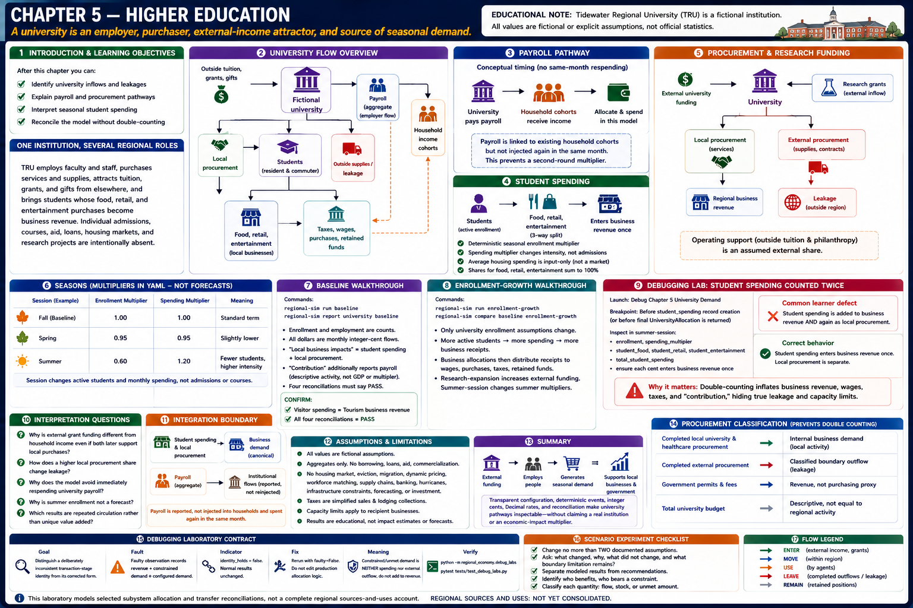
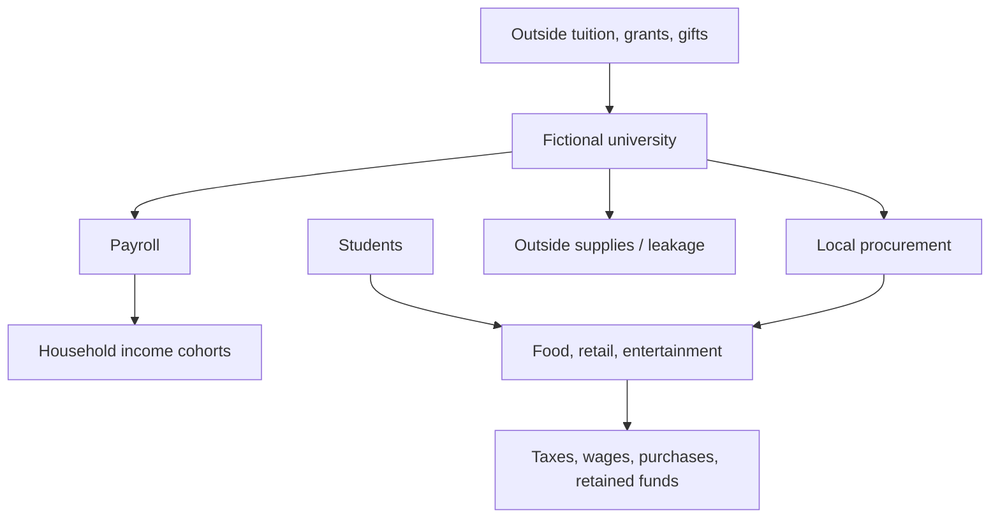
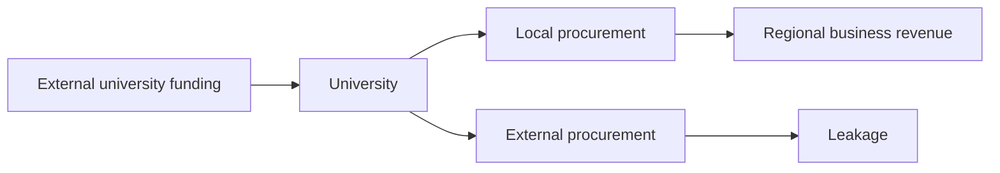

# Chapter 5 — Higher Education

## Introduction and learning objectives

Tidewater Regional University is a **fictional** institution that demonstrates why a university is much more than a place of instruction. After this chapter, you can identify university inflows and leakages, explain payroll and procurement pathways, interpret seasonal student spending, and reconcile the model without double-counting.

## One institution, several regional roles

The university employs aggregate faculty and staff, purchases services and supplies, attracts tuition, grants, and gifts from elsewhere, and brings students whose food, retail, and entertainment purchases become business revenue. Individual admissions, courses, aid, loans, housing markets, and research projects are intentionally absent.

### Payroll

Payroll is reported as the university's aggregate employer flow. Existing household cohorts remain the place where income is allocated and spent; the engine does not spend payroll again in the same month. This timing rule connects the concepts while preventing an invented second-round multiplier.

### Student spending

Resident and commuter students form one cohort. A deterministic seasonal enrollment multiplier sets active enrollment; a spending multiplier changes spending intensity. Average housing spending is accepted as contextual input but is not sent into a housing market. Food, retail, and entertainment shares sum to 100 percent and student spending enters business revenue exactly once.

### Procurement and research funding

A configured share of procurement goes to local services and enters local business revenue. The remainder represents supplies and contracted services purchased outside the region and is leakage. Research grants are a simplified external inflow, alongside an assumed external share of operating support (outside tuition and philanthropy). There are no individual grants or commercialization.

## Seasons

Fall, Spring, and Summer have explicit multipliers in YAML. Nothing is random. The baseline uses Fall; `summer-session` models a stronger fictional summer program. The session changes active students and their monthly spending, not admissions or course schedules.

## Baseline walkthrough

Run `regional-sim report university baseline`. Read enrollment and employment as counts; all dollar values are monthly integer-cent flows. “Local business impacts” is student spending plus local procurement. “Contribution” additionally reports payroll, but is a descriptive activity measure—not GDP, an impact multiplier, or a sum of unique dollars.

Then run `regional-sim trace baseline`. The arrows are conceptual educational traces rather than literal dollar tracking.

## Enrollment-growth walkthrough

Run `regional-sim compare baseline enrollment-growth`. Only fictional university enrollment assumptions change. More active students increase configured spending and business receipts; business allocations then distribute that receipt among wages, local/external purchases, taxes, and retained funds. `research-expansion` instead increases research and operating funding; `summer-session` changes summer enrollment and spending multipliers.

## Debugging laboratory: student spending counted twice

Use the safe, opt-in fixture specified in **Debugging laboratory contract** below. The fault is learner-owned and deterministic; do not edit production simulation logic.

## Interpretation questions

1. Why is external grant funding different from household income even if both later support local purchases?
2. How does a higher local procurement share change leakage?
3. Why does the model avoid immediately respending university payroll?
4. Why is summer enrollment not a forecast?
5. Which results are repeated circulation rather than unique value added?

## Integration boundary

Student spending and local university procurement enter canonical business demand. Payroll and external funding are reported institutional flows; payroll is not fed into household income and spent again in the modeled month.

## Assumptions and limitations

All university operations and values are fictional educational assumptions. Students and employees are aggregates. Payroll is linked conceptually to existing household income and is not injected a second time. Housing is input-only. Capacity limits still apply to recipient businesses. The model offers neither causal impact estimates nor forecasting, and omits workforce shortages, housing dynamics, aid and loans, commercialization, construction, matching, healthcare, transport, and infrastructure. Future chapters may transform documented public aggregate datasets, while preserving a clearly labeled fictional baseline.

## Summary

A university is simultaneously an employer, purchaser, external-income attractor, and source of seasonal demand. Transparent configuration, deterministic events, integer cents, Decimal rates, and reconciliation make those pathways inspectable without claiming a real institution or an economic-impact multiplier.

## Procurement classification

Completed local university and healthcare procurement is internal business demand; completed external procurement is a classified boundary outflow; the total budget is descriptive. Government permits and fees are revenue rather than a purchasing proxy. These classifications prevent institutional activity from being reconstructed or counted twice.

## Debugging laboratory contract

- **Goal:** distinguish a deliberately inconsistent transaction-stage identity from its corrected form without editing the engine.
- **Launch configuration:** **Chapter 05 — Inspect University Demand**.
- **Scenario:** the bundled scenario named by this chapter's executable walkthrough; the shared helper itself uses fixed learner-owned values.
- **Breakpoint:** place a semantic breakpoint inside `inspect_stage_identity()` immediately before `StageIdentityObservation` is returned.
- **Objects to inspect:** `configured_demand`, `recorded_business_revenue`, `constrained_amount`, and `identity_holds`.
- **Expected fault:** the opt-in faulty observation records revenue plus constrained demand that does not equal configured demand.
- **Reconciliation or indicator effect:** `identity_holds` is false; normal simulation results are untouched.
- **Fix:** rerun with `faulty=False`; do not edit production allocation logic.
- **Economic meaning:** constrained or interrupted demand is neither spending nor an external outflow, so it cannot be added to recorded revenue inconsistently.
- **Verification:** run `python -m regional_economy.debug_labs` and `pytest tests/test_debug_labs.py`.

## Scenario experiment checklist

Change no more than two documented assumptions in a copied scenario. Ask: **what changed, why did it change, what did not change, and what boundary limitation remains?** Separate modeled results from recommendations and identify who benefits, who bears a constraint, and whether each quantity is a flow, stock, or unmet amount.
