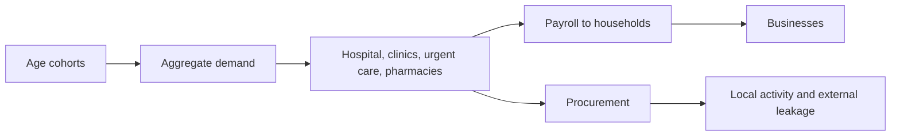
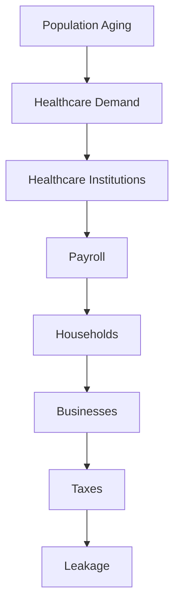

# Chapter 6 — Healthcare and an Aging Population

> Every provider, place, and value in this chapter is fictional and educational. This aggregate systems model is not clinical guidance, an official forecast, or a patient model.

## Learning objectives

After this laboratory you can explain how demographic composition changes aggregate healthcare demand; calculate cohort demand without double-counting; distinguish healthcare's service, employer, and purchaser roles; interpret payroll, procurement, local purchasing, and leakage; compare deterministic aging scenarios; and state the model's boundaries.

## Narrative introduction

Peninsula Community Health Network includes one regional hospital, four clinics, two urgent-care centers, and six aggregate pharmacies. It serves residents while employing local workers and buying supplies. It represents no real provider. An older region may need more services even when total population is unchanged, so planners must examine composition as well as headcount.



## Demographics

The YAML defines children, working-age adults, and retirees. Each unique cohort has population, outpatient/inpatient/pharmacy/preventive utilization rates, average monthly spending, labor-force participation, dependency status, and retirement-age status. Cohort populations must equal regional population. This validation makes the accounting boundary visible.

## Healthcare demand

For service *s*, `demand(s) = sum(cohort population × cohort utilization(s))`. Spending similarly sums population times average monthly spending, in integer cents. These are aggregate service units and dollars—not appointments, claims, diagnoses, or patients. Decimal rates and fixed input order make every run reproducible.

## Healthcare employment and purchasing

The network has an explicit workforce, monthly payroll, and procurement budget. Payroll is reported as reaching the household sector, but is not spent again during the same modeled month; that avoids an unsupported feedback loop. Procurement is split deterministically into local business activity and external purchasing (leakage). Healthcare-related business activity is configured resident healthcare spending plus local procurement; it is an educational activity indicator, not provider revenue or healthcare finance accounting.

## Aging populations

`aging-population` reallocates a fixed population toward retirees. `healthy-growth` grows children and working-age adults. `retiree-inmigration` adds retirees. Scenario employment, payroll, and procurement are explicit assumptions rather than optimized staffing requirements. Run:

```console
regional-sim report healthcare baseline
regional-sim run aging-population
regional-sim run healthy-growth
regional-sim run retiree-inmigration
regional-sim compare baseline aging-population
regional-sim trace aging-population
```



The trace is an educational systems trace, not a literal dollar or patient journey.

## Baseline walkthrough

Baseline has 200 children, 620 working-age adults, and 180 retirees: 1,000 residents and an 18% retirement-age share. Inspect the four demand categories, $820,000 payroll, $310,000 procurement, and its 40% local purchasing share. Confirm local plus external procurement equals total procurement.

## Aging-population walkthrough

The aging case holds population at 1,000 while moving the distribution to 170 children, 550 working-age adults, and 280 retirees. Compare it with baseline. Greater retiree utilization raises aggregate demand and spending. Employment and purchasing also rise because the scenario states that educational response; the engine does not forecast or optimize it.

## Debugging laboratory — the cohort counted twice

Use the safe, opt-in fixture specified in **Debugging laboratory contract** below. The fault is learner-owned and deterministic; do not edit production simulation logic.

## Interpretation questions

1. Why can demand rise without population growth?
2. Which scenario distinguishes composition change from total growth?
3. Why is payroll economically different from healthcare service demand?
4. What does external procurement mean here, and what does it not measure?
5. Why must employment changes remain explicit assumptions?

## Integration boundary

Configured resident healthcare spending and local healthcare procurement enter business demand. Healthcare payroll and external funding are descriptive institutional flows and do not become a second household-income cycle.

## Assumptions and limitations

All values and institutions are fictional. The period is one month. Utilization is a constant cohort average; spending is not a bill or claim. Institutions have no schedules, capacity constraints, finances, insurance, or clinical states. The model has no patient records, disease, epidemiology, workforce shortages, transport, housing response, forecasting, optimization, or machine learning. It does not infer causality. Future chapters may transform documented public aggregate demographic datasets, with provenance and geography checks, but must preserve privacy and must not silently replace assumptions.

## Chapter summary

Demographic composition drives deterministic aggregate demand. Healthcare simultaneously supplies an essential service, pays households, and purchases from businesses. Cohort validation prevents double-counting; integer-cent money, Decimal rates, fixed event order, reports, and explicit scenario assumptions keep the lesson inspectable and reproducible.

## Debugging laboratory contract

- **Goal:** distinguish a deliberately inconsistent transaction-stage identity from its corrected form without editing the engine.
- **Launch configuration:** **Chapter 06 — Inspect Healthcare Demand**.
- **Scenario:** the bundled scenario named by this chapter's executable walkthrough; the shared helper itself uses fixed learner-owned values.
- **Breakpoint:** place a semantic breakpoint inside `inspect_stage_identity()` immediately before `StageIdentityObservation` is returned.
- **Objects to inspect:** `configured_demand`, `recorded_business_revenue`, `constrained_amount`, and `identity_holds`.
- **Expected fault:** the opt-in faulty observation records revenue plus constrained demand that does not equal configured demand.
- **Reconciliation or indicator effect:** `identity_holds` is false; normal simulation results are untouched.
- **Fix:** rerun with `faulty=False`; do not edit production allocation logic.
- **Economic meaning:** constrained or interrupted demand is neither spending nor an external outflow, so it cannot be added to recorded revenue inconsistently.
- **Verification:** run `python -m regional_economy.debug_labs` and `pytest tests/test_debug_labs.py`.

## Scenario experiment checklist

Change no more than two documented assumptions in a copied scenario. Ask: **what changed, why did it change, what did not change, and what boundary limitation remains?** Separate modeled results from recommendations and identify who benefits, who bears a constraint, and whether each quantity is a flow, stock, or unmet amount.
