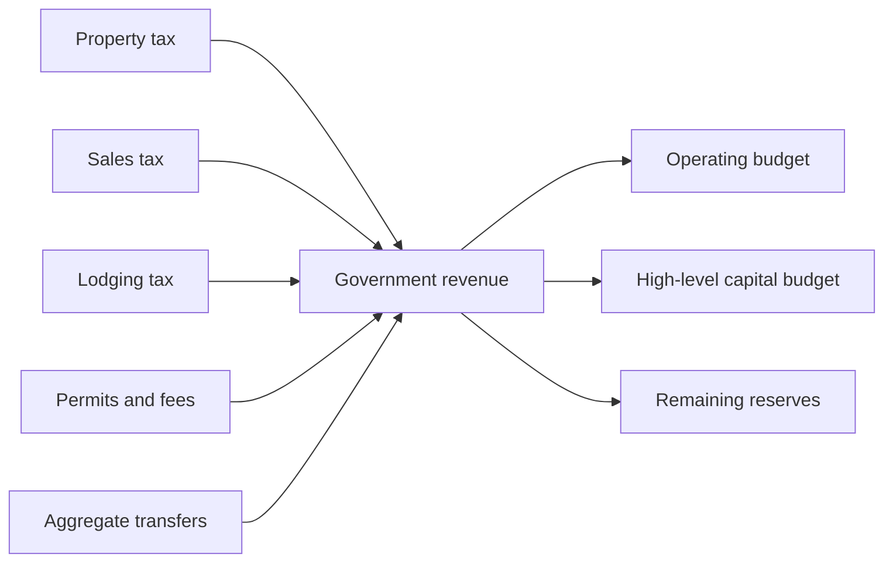
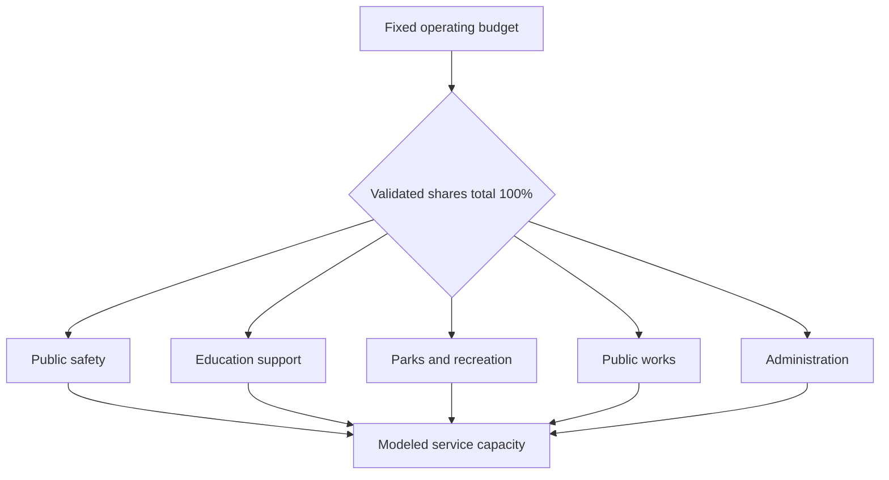

# Chapter 7 — Government and Public Services

## Learning objectives

After this chapter, you can identify simplified local revenue sources, reconcile operating allocations to a fixed budget, relate department funding to modeled capacity, compare allocation tradeoffs without choosing a preferred policy, and debug a deterministic budget failure.

## Narrative introduction

The fictional Historic Triangle Regional Government participates in the economy when it collects revenue and uses resources. It also enables households, businesses, and institutions through aggregate public services. Revenue is limited: assigning another dollar to one purpose makes that dollar unavailable elsewhere. This teaching model describes choices; it does **not** recommend policy or reproduce any jurisdiction's workflow.

## Revenue sources

Monthly government revenue combines simplified property-tax revenue, local sales tax, lodging tax, permits and fees, and aggregate state/federal transfers. Sales and lodging collections use Decimal rates and integer-cent economic activity; the other sources are explicit fictional scenario inputs. This is not a tax-administration or detailed accounting model.

## Budget allocation and department capacity

Every Chapter 7 scenario holds the monthly operating budget at **$1,200,000** and capital budget at **$200,000**. Allocation shares must total exactly 1. The cent allocator uses stable department order and assigns any rounding remainder deterministically. The five abstractions are public safety, education support, parks and recreation, public works, and administration.

Capacity is `department operating budget / assumed cost per capacity unit`. Utilization is `configured demand / modeled capacity`; above 100% means demand exceeds modeled capacity, not that work is completed or service quality is known. No employees or individual projects are represented.

## Tradeoffs

`public-safety-focus` raises the public-safety share and lowers several others. `parks-investment` raises parks capacity. `balanced-services` spreads funding differently, rather than claiming to find an optimum. Costs and demand remain fixed so the allocation effect is visible. A lower utilization can reflect greater capacity, but is not by itself evidence of better policy or quality.

## Baseline walkthrough

Run `regional-sim government-report baseline`. Confirm total revenue, then confirm department budgets sum to the operating budget. Compare capacity with demand and inspect remaining reserves after operating and capital appropriations. The sales/lodging component comes from this month's simulated transactions; all other revenue inputs are fictional assumptions.

## Public-safety-focus walkthrough

Run `regional-sim public-safety-focus`, then `regional-sim compare baseline public-safety-focus`. Total operating and capital budgets remain unchanged. Public-safety capacity rises because its share rises; capacity in departments whose shares fall declines. The comparison is descriptive, not a recommendation.

## Debugging laboratory: the missing reconciliation

**Fault:** edit a copy of the baseline so department allocation shares sum to more than 1 (for example, change public safety from `0.30` to `0.31`). This makes department budgets exceed the available operating budget.

1. Run the copied scenario and inspect the allocation validation error.
2. Locate `government.departments.*.allocation_share` and add the shares.
3. Restore a total of exactly `1.00`, without changing the fixed operating budget.
4. Run `regional-sim government-report YOUR-SCENARIO`.
5. Verify `Balanced operating allocation: PASS`, and independently sum the displayed department budgets.
6. Explain why stable order and deterministic cent reconciliation make repeated comparisons auditable: identical inputs must assign the same final cents and expose, rather than hide, an over-allocation.

## Interpretation questions

1. Which revenue sources vary with modeled activity and which are configured aggregates?
2. Why can one department gain capacity while the total budget stays fixed?
3. What does utilization above 100% mean—and what does it not mean?
4. How does the parks scenario illustrate opportunity cost?
5. Why should the model not be read as a policy ranking?

## Assumptions

All money uses integer cents; rates use `Decimal`. The period is one month. Property revenue, fees, transfers, capital spending, demand, and capacity-unit costs are fictional and explicit. Operating shares total 100%; no deficit or borrowing is allowed. Revenue remaining after the operating and high-level capital budgets becomes reserve balance. Events and departments have stable order.

## Limitations

The chapter omits elections, parties, legislation, debt, bonds, procurement systems, pensions, detailed accounting, law-enforcement operations, courts, and school administration. Capacity units are educational indices—not staff, projects, outcomes, service quality, forecasts, or optimization. Capital spending has no project-level effects. The model does not capture distributional effects or recommend a policy.

## Chapter summary

Local revenue constrains a balanced operating and capital plan. Validated allocations translate a fixed operating budget into aggregate department capacity. Alternative scenarios reveal opportunity costs while deterministic reconciliation makes every cent auditable. Government is both an economic participant and a provider of enabling services, but this simplified laboratory cannot determine which allocation a community should choose.
