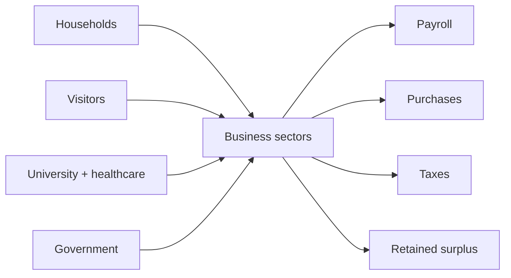
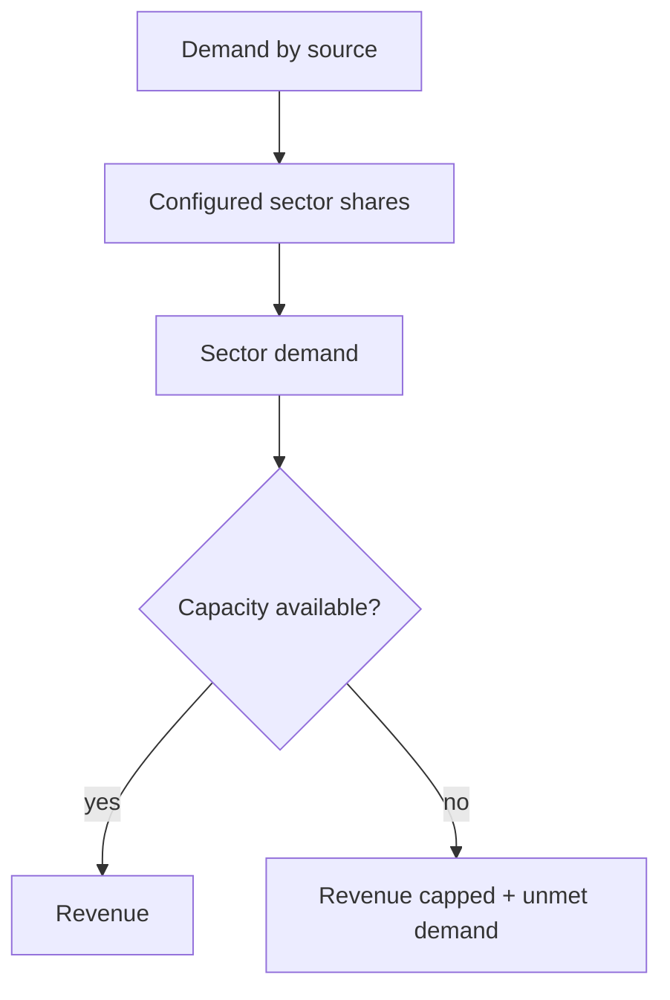

# Chapter 8 — Retail, Restaurants, and Local Business

## Learning objectives

After this chapter, you can allocate demand from several regional sources, distinguish demand from capacity-constrained revenue, interpret simplified operating surplus, compare deterministic openings and closures, and diagnose double-counted demand.

## A downtown that connects the region

The fictional Historic Triangle downtown is a mixed-use commercial district. Its **aggregate educational sectors**—retail, restaurants, personal services, and entertainment—represent no real or individual business. They turn purchases into payroll, local and external purchases, taxes, and retained operating surplus.

## Business sectors and demand allocation

Every source has configurable Decimal shares that total 100%. Integer-cent allocation uses the engine's deterministic remainder rule, so the same scenario always assigns the same cents. Households contribute local spending; visitors contribute realized visitor spending; institutions contribute local university and healthcare procurement; government demand uses the permits-and-fees activity proxy. All sources compete for the same aggregate sector capacity.

| Sector | Educational role |
|---|---|
| Retail | Local goods purchases |
| Restaurants | Prepared food and dining |
| Personal services | Neighborhood consumer and professional services |
| Entertainment | Local recreation and cultural activity |

## Operating capacity

For each sector, `revenue = min(demand, capacity)`. Utilization is revenue divided by capacity. Demand above capacity becomes unmet demand; unused capacity becomes excess capacity. Thus a busy district cannot record impossible sales. Zero capacity has zero utilization and sends all demand to unmet demand.

## Simplified profitability

Sales tax is removed from realized revenue. The remaining cents are allocated among payroll, local purchases, external purchases, and retained operating surplus. Operating costs are payroll plus both purchase categories. The allocations reconcile exactly:

`revenue = payroll + local purchases + external purchases + taxes + retained operating surplus`

This is a teaching indicator—not GAAP net income. Stronger demand may hit capacity, and proportional costs and taxes mean that revenue growth never flows entirely to surplus.

## Baseline walkthrough

Run `regional-sim business-report baseline`. Read each row left to right: demand is served only to capacity, utilization reveals pressure, unmet demand records forgone activity, and excess capacity reveals headroom. Then inspect payroll, purchases, tax, and surplus beneath the row. The dashboard aggregates openings and closures but does not invent individual firms.

## Downtown-expansion walkthrough

Run `regional-sim downtown-expansion`, then `regional-sim compare baseline downtown-expansion`. Expansion increases every sector's capacity by 25% and records two aggregate openings per sector. Demand assumptions remain fixed, isolating the capacity effect. `restaurant-boom` shifts visitor demand toward restaurants and expands restaurant capacity. `retail-decline` shifts household demand away from retail, contracts its capacity, and records four aggregate closures.

## Debugging laboratory: the twice-counted restaurant dollar

**Fault:** a developer adds visitor restaurant allocation to `revenue_by_sector` twice. Run the baseline and notice inflated restaurant demand and possibly revenue.

1. Inspect `business_demand_by_source`; sum households, visitors, institutions, and government once for restaurants.
2. Compare that sum with restaurant `demand`. A mismatch identifies the duplicate.
3. Remove the second addition and rerun the reconciliation and business report.
4. Verify source demand equals the sum of sector demand and every sector's realized revenue reconciles with its uses.
5. Explain the inflation: one visitor purchase became two revenue claims even though no second payment entered the region.

The customer-demand reconciliation checks allocated demand, while the business reconciliation checks only capacity-constrained realized revenue. Both are necessary.

## Interpretation questions

1. Which baseline sector is closest to capacity, and why is revenue not equal to demand there?
2. Can expansion increase excess capacity without increasing revenue?
3. Why does a restaurant boom affect retail or entertainment demand shares?
4. Which retained-surplus comparison is meaningful, and what information would detailed accounting still require?
5. Why must institutional procurement appear only once?

## Assumptions

The simulation is one deterministic month. Money uses integer cents; rates use `Decimal`. Sector shares and capacity are explicit fictional assumptions. Openings and closures are scenario inputs, not forecasts. Event order remains reproducible. Government demand is an educational proxy and does not describe procurement accounting.

## Limitations

There are no individual businesses, inventories, supply chains, banking or lending, workforce shortages, transportation, commercial real estate, dynamic pricing, optimization, forecasting, or detailed accounting. Capacity does not migrate between sectors. The model neither estimates business survival nor recommends investment.

## Chapter summary

Regional demand becomes business revenue only when capacity can serve it. Revenue supports payroll, local purchases, taxes, external purchases, and retained operating surplus. Multiple sectors depend on common household, visitor, institutional, and government conditions, so transparent allocation and reconciliation prevent double counting.
