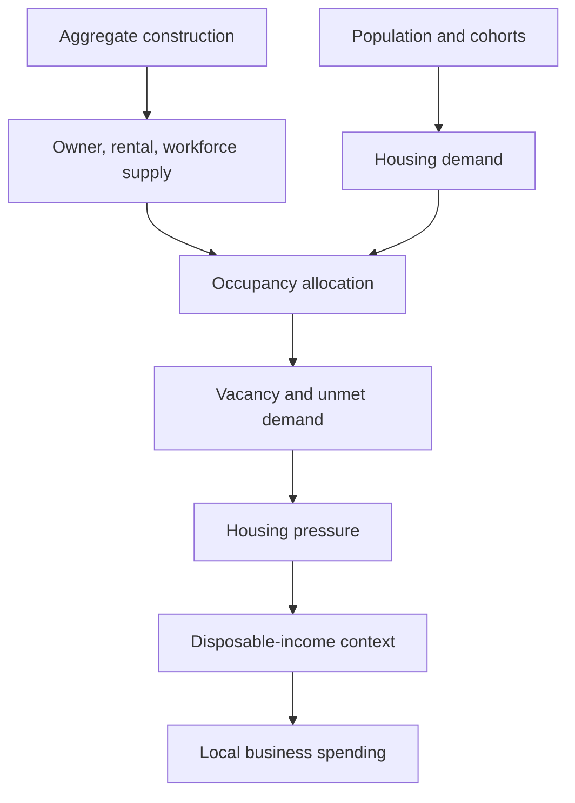
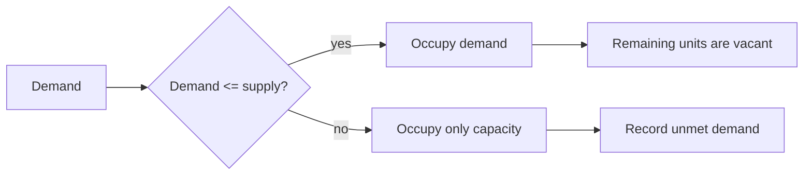

# Chapter 9 — Housing and Affordability

## Learning objectives

After this chapter, you can explain housing as a regional capacity constraint; calculate aggregate occupancy, vacancy, and unmet demand; distinguish income from affordability; interpret workforce-housing utilization and the housing pressure index; compare deterministic construction scenarios; and debug an impossible allocation.

## A growing region needs somewhere to live

A new job is a benefit, but a worker also needs a feasible place to live. If population, student, retiree, or seasonal-resident demand grows faster than housing supply, the region cannot create occupancy by arithmetic. Availability tightens, configured housing costs consume household income, and money available for local businesses may fall. Housing is therefore capacity—not merely another expense.

This fictional system contains no addresses, neighborhoods, landlords, mortgages, valuations, zoning, lending, speculation, migration, or commercial property. It is an educational aggregate.

## Supply and construction

Supply is the sum of owner-occupied, rental, and workforce categories plus configured construction units. `annual_construction_rate` is a reported assumption; `construction_units` is the deterministic capacity addition used by the one-month scenario. Construction adds units but never edits household income. Categories are aggregate labels, not property records.

## Demand

Demand is the configured sum of household-cohort, student, retiree, and optional seasonal-resident units. Workforce demand is tracked as a utilization lens and is not added again: workforce households are already present in the demand cohorts. This avoids double counting.

## Occupancy and vacancy

The allocation enforces:

- `occupied = min(demand, supply)`;
- `vacant = supply - occupied`;
- `unmet = max(0, demand - supply)`;
- `occupancy rate = occupied / supply`; and
- `vacancy rate = vacant / supply`.

Thus occupancy plus vacancy equals supply and the two rates sum to 100% whenever supply is nonzero.

## Affordability and workforce housing

Affordability differs from income. A household with income can still face a high configured housing-cost burden after required costs; two households with similar income can have different costs. The dashboard retains cost-burden indicators and adds capacity indicators.

Workforce utilization is served workforce demand divided by workforce units, capped by capacity. Available workforce units cannot be negative. The pressure index is a transparent, bounded teaching indicator:

`70% × occupancy rate + 30% × unmet-demand share`.

It is not a price, forecast, market-clearing result, or official affordability statistic. Housing costs remain configurable educational assumptions.

## Baseline walkthrough

Run `regional-sim housing-report baseline`. Confirm total units reconcile to occupied plus vacant units. Read occupancy beside vacancy, then inspect workforce utilization, unmet demand, pressure, and household cost burden. The measures answer different questions: capacity may be tight even where aggregate income is high.

## Housing-shortage walkthrough

Run `regional-sim compare baseline housing-shortage`. The shortage removes owner-category capacity and slows the assumed construction rate. Occupancy is capped, vacancy falls, unmet demand appears, and pressure rises. Existing household income and configured costs do not magically change. This isolates a capacity experiment rather than claiming to simulate a market response.

The other experiments separate mechanisms: `housing-boom` adds aggregate construction, while `workforce-housing-expansion` expands the workforce category and lowers its utilization.

## Debugging laboratory: impossible occupancy

**Injected defect:** change a category with `units: 250, occupied_units: 210` to `units: 200, occupied_units: 210`.

1. Run the housing report and stop at the semantic breakpoint **“housing configuration parsed / before demand allocation.”**
2. Inspect the category's total and occupied values.
3. Identify the reconciliation error: 210 occupied units cannot fit in 200 units.
4. Correct the allocation (raise valid capacity or reduce occupied units; do not clamp and hide the input error).
5. Continue to **“housing capacity reconciled / before dashboard rendering.”**
6. Verify every category has `occupied <= units`, regional occupied units do not exceed total units, occupied plus vacant equals total, and rates remain between zero and one.
7. Explain the consequence: impossible occupancy understates vacancy, hides unmet demand, distorts pressure, and makes downstream regional interpretation misleading.

These are semantic breakpoints—meaningful moments in the calculation—so the exercise works in a debugger or with temporary assertions without depending on source line numbers.

## Interpretation questions

1. Why can employment growth create both income and housing pressure?
2. Why is a zero vacancy rate not evidence that every household obtained housing?
3. Which indicator isolates workforce-oriented capacity?
4. Why should construction not immediately change income or eliminate cost burden?
5. What does the pressure index omit that a real housing study would require?

## Assumptions and limitations

All units, demand, costs, and rates are fictional, deterministic assumptions. One aggregate demand unit is treated as requiring one aggregate housing unit. Preferred-housing mismatch is represented by unmet demand only when total demand exceeds supply; category substitution is not modeled. Construction is immediate scenario capacity, not a permitting or building pipeline. There are no prices, market clearing, behavior, forecasting, optimization, individual homes, migration, finance, or policy recommendations. Future chapters may add richer housing behavior, but this chapter intentionally does not.

## Chapter summary

Housing connects population and employment to finite regional capacity. Deterministic allocation prevents impossible occupancy; vacancy and unmet demand reveal slack or shortage; workforce utilization describes one critical category; and a documented index summarizes pressure. Construction expands capacity, but affordability remains linked to configured costs and household budgets rather than being instantly solved.
