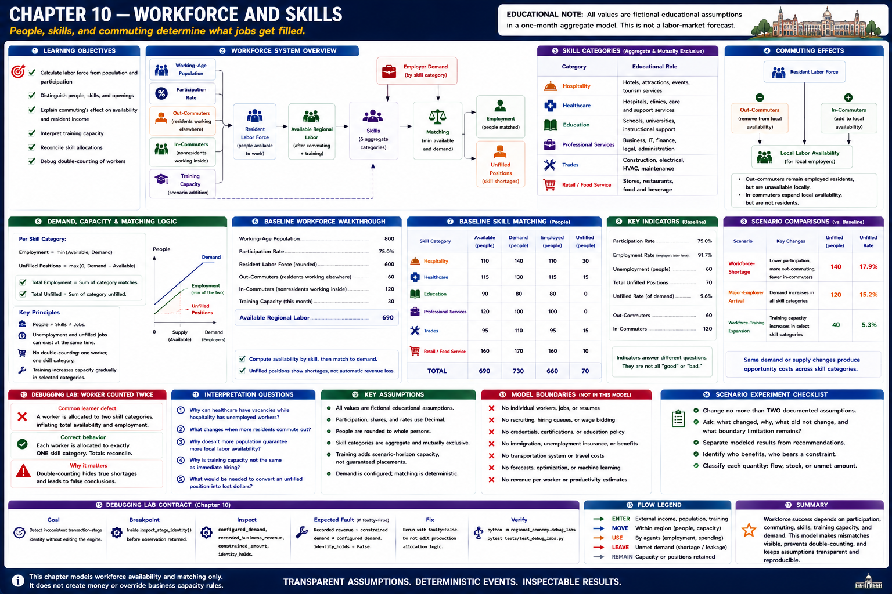
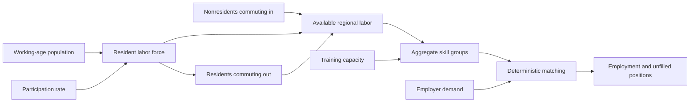
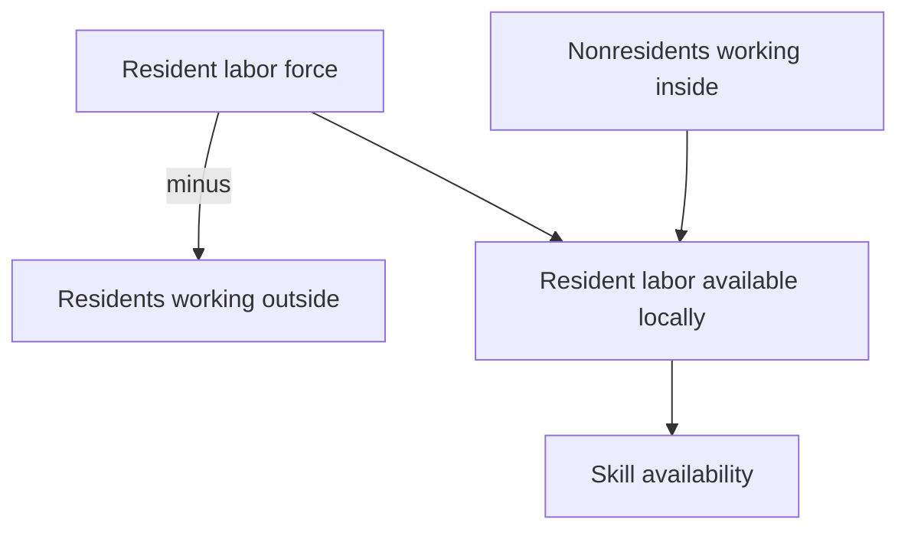
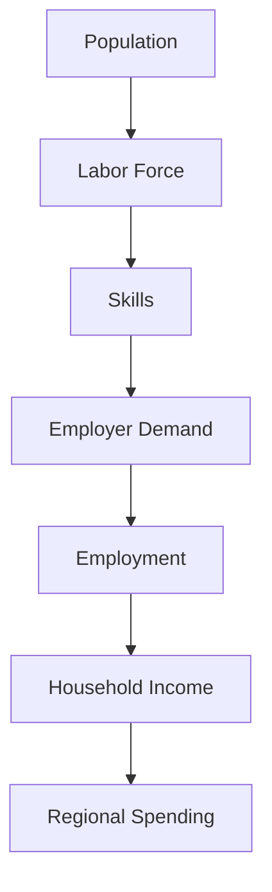

# Chapter 10 — Workforce and Skills



> Every value is a fictional aggregate educational assumption. The deterministic model is not a labor-market forecast.

## Learning objectives

After this chapter, you can calculate a labor force from working-age population and participation; distinguish people, skills, and openings; explain commuting's effect on resident income and local availability; interpret training capacity; reconcile skill allocations; and diagnose double-counting.

## Narrative introduction

A region can display unemployment and unfilled jobs simultaneously. A person who is available is not automatically available in the skill group an employer requires. Some residents commute out, some nonresidents commute in, and training changes selected capacity only gradually. Jobs alone therefore do not guarantee that the required workforce exists.



## Labor-force participation

The resident labor force is `working-age population × participation rate`, rounded deterministically to a whole person. Participation is a `Decimal`, never a binary state assigned to an individual. Available regional labor starts with the resident labor force, subtracts residents working elsewhere, adds nonresidents working inside, and adds configured scenario training capacity. Employment, unemployment, available workers, and openings remain separate indicators.

## Skill categories

The six deliberately broad categories are hospitality, healthcare, education, professional services, trades, and retail/food service. Scenario shares partition one labor pool. They are neither credentials nor detailed occupations. Allocation follows enum order and balances the last category so the same base worker cannot appear twice.

## Commuting

Out-commuters remain members of the resident labor force and count as employed residents, but are unavailable to local employers. In-commuters expand local labor availability but are not resident workers. The existing household budgets represent configured aggregate income; commuting does not add transport routes, travel costs, or a second payroll flow.



## Workforce demand and capacity

Each scenario supplies demand by skill category. Matching is `min(available, demand)` and unfilled positions are `max(0, demand − available)`. Total employment is the sum of mutually exclusive skill matches. A shortage indicator documents capacity that activity would require; it does not simulate vacancies, applications, recruiting, wage bidding, or individual hiring. Existing business revenue retains its Chapter 8 monetary capacity rule; Chapter 10 does not invent a precise revenue-per-worker coefficient.

## Training capacity

Training is a deterministic scenario addition allocated across selected categories. It represents capacity made available over the scenario horizon, not individual enrollment or guaranteed placement. The expansion scenario changes the capacity assumption; it does not model education policy, course selection, or optimization.

## Systems trace



Run `regional-sim trace baseline`. This is an educational systems trace rather than a prediction of labor-market outcomes or a literal tracked worker or dollar.

## Baseline walkthrough

Run:

```console
regional-sim report workforce baseline
regional-sim compare baseline workforce-shortage
```

1. Verify labor-force size from 800 working-age people at 75% participation.
2. Reconcile commuters: subtract 60 out and add 120 in.
3. Add the configured training capacity and sum skill availability.
4. Compare each category's availability, demand, employment, and unfilled count.
5. Confirm total unfilled positions equals the category sum.

The baseline intentionally permits unemployment and shortages to coexist. The apparent paradox is skill mismatch, not an error.

## Workforce-shortage walkthrough

Run `regional-sim run workforce-shortage`. Participation falls, out-commuting rises, and in-commuting falls while demand remains visible. Compare labor availability and unfilled positions with baseline. Then run `major-employer-arrival` to see demand rise without assuming people appear, and `workforce-training-expansion` to see selected availability expand deterministically.

## Debugging laboratory: the worker in two sectors

Use the safe, opt-in fixture specified in **Debugging laboratory contract** below. The fault is learner-owned and deterministic; do not edit production simulation logic.

## Interpretation questions

1. Why can healthcare vacancies coexist with unemployed hospitality workers?
2. Which indicators change when an employed resident begins commuting out?
3. Why is a higher population insufficient evidence of greater local labor availability?
4. Why should training capacity not be interpreted as instantaneous hiring?
5. What information would be required before translating an unfilled position into lost dollars?

## Integration boundary

Workforce shortages are reported matching and capacity indicators; they do not directly impose an additional production constraint in the canonical transaction pipeline.

## Assumptions

- Workforce groups and skills are aggregate and mutually exclusive educational categories.
- Participation and allocations are `Decimal` rates; people are deterministically rounded.
- Commuting is an aggregate boundary flow without transportation modeling.
- Training adds scenario-horizon category capacity and has no individual learners.
- Demand is configured and matching has stable skill order.
- Monetary flows remain integer cents; workforce counts do not create new money automatically.

## Limitations

There are no individual workers, occupations, credentials, hiring queues, recruiting, payroll administration, unemployment insurance, immigration, wage optimization, education policy, transport networks, machine learning, or forecasts. Skill transferability, job quality, hours, wages, remote work, and demographic participation dynamics are outside this chapter. Results must not be used as workforce advice.

## Chapter summary

Regional employment depends jointly on workforce size, participation, commuting, skills, training, and employer demand. The model makes mismatch inspectable: available people do not guarantee the right aggregate skills, and openings do not create workers. Reconciled allocation prevents duplicate capacity and deterministic scenarios make assumptions reproducible.

## Debugging laboratory contract

- **Goal:** distinguish a deliberately inconsistent transaction-stage identity from its corrected form without editing the engine.
- **Launch configuration:** **Chapter 10 — Inspect Workforce Matching**.
- **Scenario:** the bundled scenario named by this chapter's executable walkthrough; the shared helper itself uses fixed learner-owned values.
- **Breakpoint:** place a semantic breakpoint inside `inspect_stage_identity()` immediately before `StageIdentityObservation` is returned.
- **Objects to inspect:** `configured_demand`, `recorded_business_revenue`, `constrained_amount`, and `identity_holds`.
- **Expected fault:** the opt-in faulty observation records revenue plus constrained demand that does not equal configured demand.
- **Reconciliation or indicator effect:** `identity_holds` is false; normal simulation results are untouched.
- **Fix:** rerun with `faulty=False`; do not edit production allocation logic.
- **Economic meaning:** constrained or interrupted demand is neither spending nor an external outflow, so it cannot be added to recorded revenue inconsistently.
- **Verification:** run `python -m regional_economy.debug_labs` and `pytest tests/test_debug_labs.py`.

## Scenario experiment checklist

Change no more than two documented assumptions in a copied scenario. Ask: **what changed, why did it change, what did not change, and what boundary limitation remains?** Separate modeled results from recommendations and identify who benefits, who bears a constraint, and whether each quantity is a flow, stock, or unmet amount.
