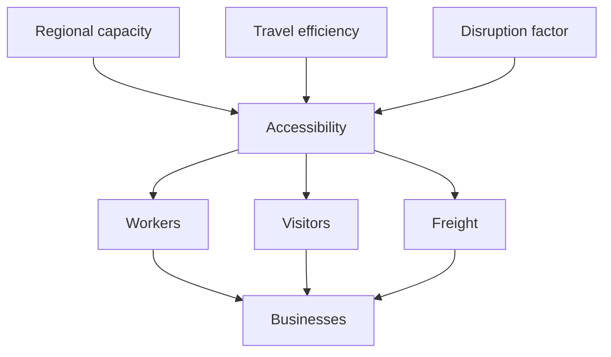

# Chapter 11 — Transportation and Accessibility

## Learning objectives

After this laboratory you can explain accessibility as an economic capacity constraint; distinguish commuter, visitor, and freight access; inspect deterministic capacity rationing; trace a disruption across sectors; and interpret accessibility without mistaking the model for traffic engineering.

## Narrative introduction

Transportation is not simply movement of vehicles. It connects households to jobs, visitors to attractions, institutions to workers, businesses to customers, and freight to organizations. The laboratory therefore represents transportation as aggregate *accessibility*. A disruption lowers activity that can occur this month; it does not remove residents.

## Accessibility concepts

The YAML specifies regional roadway capacity in fictional trip-equivalent units, three access rates, average travel efficiency, and a disruption factor. The engine applies efficiency and disruption once. If accessible demand exceeds capacity, one common deterministic capacity factor rations commuter, visitor, and freight access. The accessibility index is their arithmetic mean.

## Commuter movement

Commuter accessibility scales effective participation and aggregate in/out commuting. It does not permanently change population. A closure can therefore reduce available labor and local household-derived demand for the month.

## Visitor access

Visitor accessibility scales visitors who can reach the region and their spending. This is separate from lodging and attraction capacity: transportation is an upstream access constraint.

## Freight access

Freight is a single capacity indicator, not an inventory system. It scales accessible local procurement for the university and healthcare, representing the retail, restaurant, healthcare, and university dependence on deliveries without modeling shipments, warehouses, or logistics optimization.

## Travel time and disruptions

Average travel efficiency is the simplified travel-time proxy: lower efficiency means fewer movements are economically effective. The disruption factor represents a temporary closure. Neither value calculates minutes, routes, signals, GPS paths, or individual trips.

## Baseline walkthrough

Run `regional-sim transportation-report baseline`. Baseline has neutral access and enough trip-equivalent capacity for configured demand. Compare the dashboard's transportation capacity, utilization, three access rates, and accessibility index. Then run `regional-sim transportation-trace baseline`; it is a systems-thinking visualization, not a literal trip trace.

## Corridor-closure walkthrough

Run `regional-sim corridor-closure` and `regional-sim compare baseline corridor-closure`. The temporary closure lowers capacity, efficiency, and disruption factor. Inspect lower commuter participation, visitor spending, freight-accessible procurement, business revenue, and accessibility. Population remains unchanged.

`tourism-congestion` emphasizes visitor access during congestion. `road-improvement` raises capacity and access across uses. All three scenarios contain fixed inputs and no random draw.

## Debugging laboratory — the constraint applied twice

**Fault:** after `TransportationSystem.evaluate()` already multiplies accessibility by `disruption_factor`, accidentally multiply `transportation.commuter_accessibility` by the disruption again in `run_scenario`. Accessibility will be too low.

1. Set a semantic breakpoint at `TransportationSystem.evaluate` and inspect `common`, `access`, `accessible`, and `capacity_factor`.
2. Continue to `run_scenario` immediately after `transportation = scenario.transportation.evaluate()`.
3. Confirm the returned access rate is passed downstream unchanged; search for every use of `disruption_factor`.
4. Remove the duplicate multiplier and run `pytest tests/test_transportation.py`.
5. Verify `effective_demand <= capacity` and compare the closure report twice for identical output.

This semantic breakpoint follows the model boundary rather than a fragile line number. Double-applying a constraint understates workers, visitors, freight, business demand, household circulation, and regional activity even though only one disruption occurred.

## Interpretation questions

1. Why does an upstream closure influence both tourism and institutions?
2. Why should inaccessible activity not be interpreted as population loss?
3. When does capacity bind, and why is demand never recorded above effective capacity?
4. Why might an improvement influence several sectors without forecasting growth?
5. Which conclusions would require GIS or observed travel-time data and therefore cannot be drawn here?

## Assumptions

Values are fictional monthly educational assumptions. Access rates are Decimal values from zero through one. Monetary effects remain integer cents with round-half-up multiplication. Capacity is aggregate and deterministic; one common rationing factor avoids privileging a use through processing order. Stable event ordering is unchanged.

## Limitations

There are no individual roads or vehicles, GIS, GPS routing, public-transit schedules, signals, fuel markets, autonomous vehicles, detailed logistics, inventories, optimization, forecasting, or machine learning. The accessibility index is descriptive, not a welfare measure or infrastructure recommendation.

## Chapter summary

Transportation is modeled as access to economic connections. Capacity, efficiency, and disruptions determine effective commuter, visitor, and freight access; these propagate to institutions, businesses, households, and activity. The small aggregate model makes the constraint inspectable and reproducible while deliberately refusing traffic-simulation precision.
