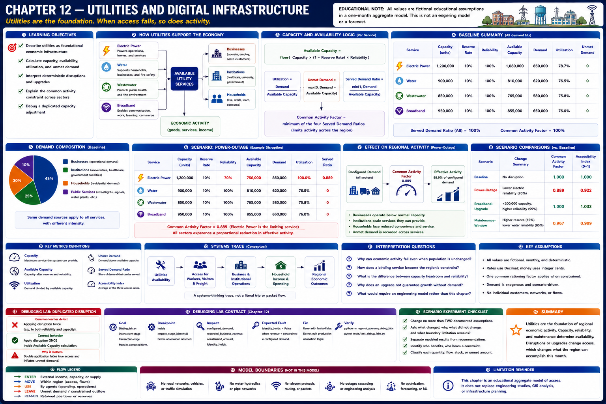
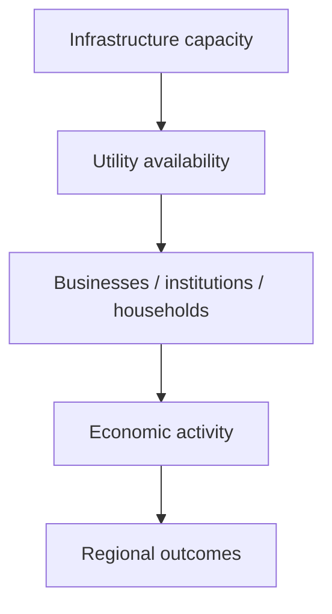
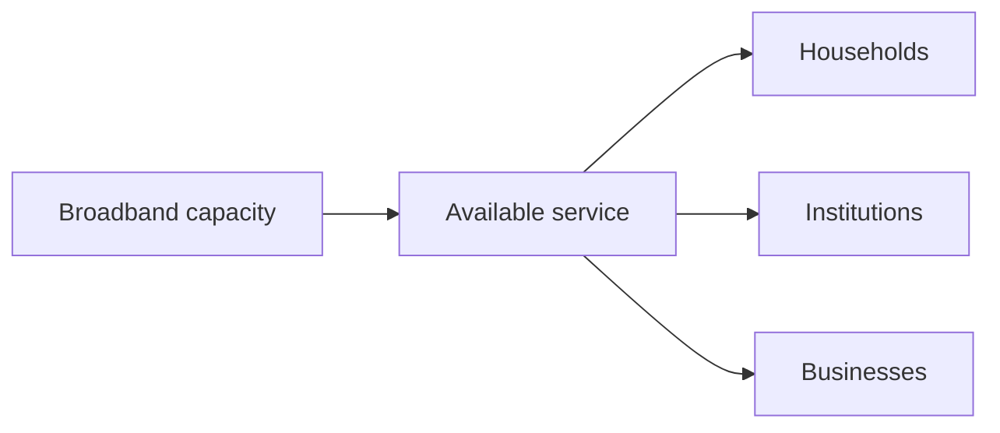

# Chapter 12 — Utilities and Digital Infrastructure

## Learning objectives

After this chapter, you can describe utilities as foundational economic infrastructure; calculate aggregate capacity, available capacity, utilization, reliability, and unmet demand; interpret deterministic disruptions and upgrades; and debug a duplicated capacity adjustment.

## Narrative introduction

A region may have workers, buildings, and customers, yet still lose activity when electricity, water, wastewater, or broadband is unavailable. This chapter treats each service as one aggregate regional system. It deliberately does not represent substations, pipes, network nodes, customers, protocols, routing, or engineering flows.

## Utility systems

Each service has configured capacity, demand, and reliability. One maintenance-reserve rate preserves spare capacity. Available capacity is `floor(capacity × (1 − reserve) × reliability)`. Utilization is demand divided by available capacity; unmet demand is the positive difference between demand and available capacity. The smallest served-demand ratio becomes the common activity factor, illustrating how a binding foundation can affect several sectors at once.

This is a systems-thinking illustration, not an engineering simulation.

## Infrastructure capacity and reliability

Capacity is a ceiling, not output. Reliability is the deterministic share available in the selected scenario. Spare capacity can absorb demand or lost availability, while an explicit reserve supports maintenance and resilience. The model records rather than hides demand above available capacity; it does not simulate cascading failures.

## Broadband as economic infrastructure

Broadband supports remote work, commerce, education, healthcare, tourism information, and government services. It uses the same aggregate accounting as physical utilities. No protocols, cybersecurity, internet routing, or individual connections are modeled.

## Baseline walkthrough

Run `regional-sim report utilities baseline`. Compare capacity with available capacity: reserve and reliability are applied exactly once. Baseline demand fits within every service, so unmet utility demand and constrained activity are zero. Utilization below 100% represents headroom, not inefficiency by itself.

## Power-outage walkthrough

Run `regional-sim run power-outage`, then `regional-sim compare baseline power-outage`. The scenario lowers electric reliability deterministically without changing demand. Electric available capacity binds, unmet demand appears, and the common activity factor reduces effective customer demand across businesses and institutions. The result illustrates simultaneous dependence; it does not claim a sector-specific outage chronology.

The `broadband-upgrade` scenario adds broadband capacity and reliability. The `maintenance-window` scenario increases the reserved share and temporarily lowers water reliability. Repeated runs are byte-stable.

## Debugging laboratory — the double reduction

Use the safe, opt-in fixture specified in **Debugging laboratory contract** below. The fault is learner-owned and deterministic; do not edit production simulation logic.

## Interpretation questions

1. Why can unchanged demand produce lower activity during an outage?
2. Which distinction matters between installed and available capacity?
3. Why can one binding service affect households and institutions together?
4. When does spare capacity represent resilience rather than waste?
5. What can this model explain, and what would require an engineering model?

## Assumptions

All capacity units and demands are fictional aggregate educational inputs. Rates use `Decimal`; monetary impacts remain integer cents. Service ordering is electric, water, wastewater, then broadband. Reliability, maintenance, disruptions, and upgrades are scenario-driven and deterministic. A single limiting-service factor is a transparent teaching abstraction.

## Limitations

There is no electrical grid, water hydraulics, telecommunications protocol, cybersecurity, routing, smart-grid optimization, forecasting, network solver, cascading failure, or individual utility customer. Results are not engineering-grade capacity studies, reliability forecasts, or investment recommendations.

## Chapter summary

Utilities enable regional activity. Capacity, reserve, and reliability determine availability; demand beyond availability creates unmet demand and constrains activity. Deterministic outage, upgrade, and maintenance scenarios make these relationships reproducible while keeping the model firmly at an aggregate educational level.

## Debugging laboratory contract

- **Goal:** distinguish a deliberately inconsistent transaction-stage identity from its corrected form without editing the engine.
- **Launch configuration:** **Chapter 12 — Inspect Utility Stage**.
- **Scenario:** the bundled scenario named by this chapter's executable walkthrough; the shared helper itself uses fixed learner-owned values.
- **Breakpoint:** place a semantic breakpoint inside `inspect_stage_identity()` immediately before `StageIdentityObservation` is returned.
- **Objects to inspect:** `configured_demand`, `recorded_business_revenue`, `constrained_amount`, and `identity_holds`.
- **Expected fault:** the opt-in faulty observation records revenue plus constrained demand that does not equal configured demand.
- **Reconciliation or indicator effect:** `identity_holds` is false; normal simulation results are untouched.
- **Fix:** rerun with `faulty=False`; do not edit production allocation logic.
- **Economic meaning:** constrained or interrupted demand is neither spending nor an external outflow, so it cannot be added to recorded revenue inconsistently.
- **Verification:** run `python -m regional_economy.debug_labs` and `pytest tests/test_debug_labs.py`.

## Scenario experiment checklist

Change no more than two documented assumptions in a copied scenario. Ask: **what changed, why did it change, what did not change, and what boundary limitation remains?** Separate modeled results from recommendations and identify who benefits, who bears a constraint, and whether each quantity is a flow, stock, or unmet amount.
