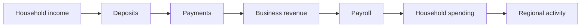
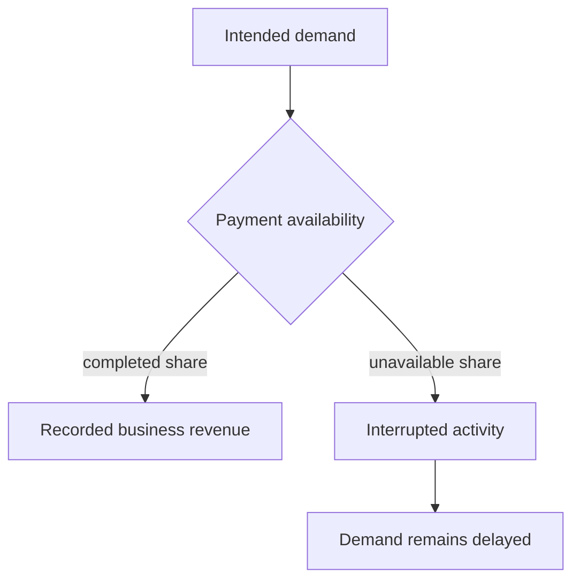

# Chapter 13 — Banking, Credit, and Payments

## Learning objectives

After this chapter you can explain how aggregate deposits support lending, distinguish credit from income, trace payments into business revenue, interpret an outage without deleting demand, and identify the boundary between a regional model and a payment-network implementation.

## Narrative introduction

A region may have willing buyers and capable sellers yet lose current activity when financial infrastructure is unavailable. Fictional **Historic Triangle Community Bank** and **Colonial Credit Cooperative** represent the whole banking sector as educational aggregates. They are not real institutions.

## Deposits and lending

Household and business deposits are configured aggregate balances, not accounts. Total deposits are their sum. Lending capacity equals total deposits times the configured Decimal capacity rate; available credit equals capacity less outstanding business and consumer lending, floored at zero. Credit is permission/capacity to borrow, not earned income or cash received. More available business credit can support later expansion, hiring, and investment, but this one-month model does not assume that every available dollar is borrowed.

## Payments and business credit

Payment availability is the share of intended monthly local transaction value completed. Completed payments become customer revenue exactly once. Reliability is a separate descriptive operating-quality indicator. This deliberately includes no ACH, cards, authorization, settlement, routing, messages, fraud controls, accounts, amortization, or ledger replay. Those mechanics belong in the **Digital Banking Systems Laboratory**.

## Baseline walkthrough

Run `regional-sim report banking baseline`. Two fictional institutions hold $30 million in aggregate deposits. The 80% capacity assumption produces $24 million of lending capacity; after $18 million of outstanding lending, $6 million remains available. At 100% payment availability, all otherwise accessible demand completes.

## Payment-outage walkthrough

Run `regional-sim compare baseline payment-outage`. The outage makes 65% of intended transactions available. The other 35% is reported as interrupted, not erased or silently treated as leakage. Business revenue, its operating allocations, and current regional activity fall together. The simulation does not forecast when delayed demand returns.

`credit-tightening` lowers the deposit-to-capacity rate. `expanded-business-lending` increases capacity and outstanding business lending. Both expose credit headroom without inventing immediate purchases.

## Debugging laboratory — duplicated completed payments

Use the safe, opt-in fixture specified in **Debugging laboratory contract** below. The fault is learner-owned and deterministic; do not edit production simulation logic.

## Interpretation questions

1. Why can an outage reduce recorded activity while demand still exists?
2. Why must available credit not be added to household income?
3. Which business decisions might tighter credit constrain without changing current demand?
4. Why does duplicated payment volume overstate regional activity?
5. Which questions require the Digital Banking Systems Laboratory instead?

## Integration boundary

Deposits are stocks and available credit is capacity, not income. Payment completion constrains current transactions; interrupted demand is neither leakage nor recorded revenue.

## Assumptions

All values are fictional monthly aggregates stored as integer cents; rates use `Decimal`. Scenario inputs, allocation rounding, and event ordering are deterministic. Every intended local demand source uses the same payment-availability factor. Interrupted value remains a reported stock of delayed activity only for this result. Deposits do not dynamically accrue from this month's flows, and lending capacity is a transparent indicator rather than a regulatory ratio.

## Limitations

There are no accounts, borrowers, underwriting, interest, amortization, bank balance sheets, reserves, capital regulation, defaults, network mechanics, forecasts, optimization, or policy claims. Payment reliability does not generate random failures. This is regional systems thinking, not banking, accounting, or investment advice.

## Connections to Garcia Systems laboratories

The **Inventory Synchronization Laboratory** teaches inventory consistency deeply; the **Digital Banking Systems Laboratory** teaches payment and banking implementation mechanics; the **Marketplace Pricing and Solutions Engineering Lab** teaches marketplace/pricing solution design. Each isolates one subsystem. The Regional Economy Laboratory shows conceptually how such subsystems interact in a larger economy. There are no runtime or repository dependencies among them.

## Chapter summary

Deposits support an aggregate lending-capacity indicator, credit supports potential growth, and available payments translate demand into current business revenue. A disruption delays transaction activity and propagates through business allocations. The regional model stops at economic effects; implementation-level payment behavior stays in its dedicated laboratory.

## Debugging laboratory contract

- **Goal:** distinguish a deliberately inconsistent transaction-stage identity from its corrected form without editing the engine.
- **Launch configuration:** **Chapter 13 — Inspect Payment Stage**.
- **Scenario:** the bundled scenario named by this chapter's executable walkthrough; the shared helper itself uses fixed learner-owned values.
- **Breakpoint:** place a semantic breakpoint inside `inspect_stage_identity()` immediately before `StageIdentityObservation` is returned.
- **Objects to inspect:** `configured_demand`, `recorded_business_revenue`, `constrained_amount`, and `identity_holds`.
- **Expected fault:** the opt-in faulty observation records revenue plus constrained demand that does not equal configured demand.
- **Reconciliation or indicator effect:** `identity_holds` is false; normal simulation results are untouched.
- **Fix:** rerun with `faulty=False`; do not edit production allocation logic.
- **Economic meaning:** constrained or interrupted demand is neither spending nor an external outflow, so it cannot be added to recorded revenue inconsistently.
- **Verification:** run `python -m regional_economy.debug_labs` and `pytest tests/test_debug_labs.py`.

## Scenario experiment checklist

Change no more than two documented assumptions in a copied scenario. Ask: **what changed, why did it change, what did not change, and what boundary limitation remains?** Separate modeled results from recommendations and identify who benefits, who bears a constraint, and whether each quantity is a flow, stock, or unmet amount.
