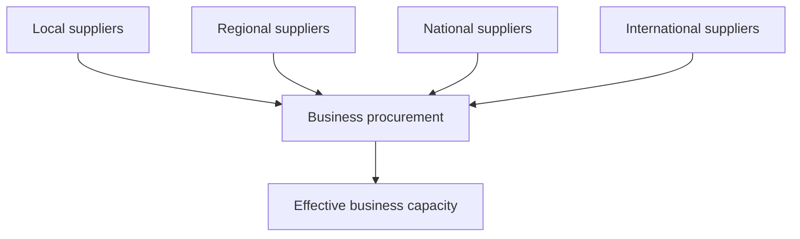
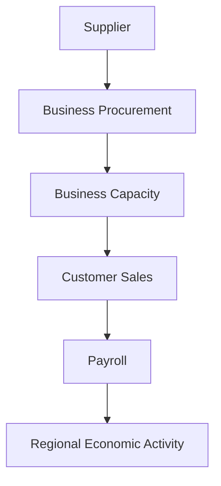

# Chapter 14 — Supply Chains and Regional Commerce

## Learning objectives

After this chapter, you can distinguish local from external procurement, interpret aggregate supplier availability and deterministic lead times, explain why constrained inputs reduce sales despite strong demand, reconcile procurement classifications, and describe the boundary between a regional economic model and an operational inventory system.

## Narrative introduction

A busy shop still cannot make every sale if the inputs it needs do not arrive. Supply chains connect suppliers to business procurement, capacity, customer sales, payroll, and regional activity. Reliable and diverse suppliers help demand become output. Local procurement also keeps a larger share of business spending circulating inside the fictional region.

This chapter models those economic consequences only. It does **not** model stock units, warehouses, barcodes, replenishment, purchase orders, routing, or ERP. The separate **Inventory Synchronization Laboratory** teaches those operational implementation details; the Regional Economy Laboratory consumes no code or runtime dependency from it.

## Supplier networks

Four aggregate categories—local, regional, national, and international—each have a procurement share and availability rate. Weighted availability is procurement reliability:

`reliability = Σ(category share × category availability)`

The categories are illustrative, not named firms or geographic measurements. A supplier outage is represented by lowering a category's availability deterministically.

## Local versus external sourcing

Only the `local` category is local procurement. Regional, national, and international purchases are external to the modeled region and therefore leakage. Classification does not change total procurement by itself; it changes how much spending remains in the region. The `local-sourcing` scenario shifts the mix from 25% to 55% local while availability remains normal.

## Lead times

Lead time affects capacity, never inventory quantities. The transparent factors are normal 100%, moderate delay 90%, and severe delay 70%. Effective capacity uses the smaller of weighted supplier reliability and the lead-time factor. This deliberately simple rule makes the binding assumption visible and reproducible.

## Procurement and activity

Business operating allocations still reserve a fixed combined share for procurement. Chapter 14 divides that procurement between local and external suppliers using the configured mix. Effective capacity is `configured capacity × supply capacity factor`; constrained activity is potential sales at configured capacity minus actual sales at supply-constrained capacity.

This trace is conceptual; it does not track a shipment, item, or literal dollar.

## Baseline walkthrough

Run `regional-sim report supply baseline`. The mix is 25% local, 25% regional, 35% national, and 15% international. Every category is 100% available, lead time is normal, reliability and capacity are 100%, and supply-constrained activity is zero. Confirm local plus external business procurement equals total procurement.

## Supplier-delay walkthrough

Run `regional-sim run supplier-delay`, then `regional-sim compare baseline supplier-delay`. Category availability ranges from 98% to 92%, producing 95% weighted reliability. The moderate-delay assumption binds at 90%, reducing effective capacity, sales, payroll, procurement, and taxes even though configured customer demand is unchanged.

`external-disruption` combines reduced regional/national/international availability with a severe delay. `local-sourcing` changes circulation without a disruption. These are deterministic teaching cases, not forecasts.

## Debugging laboratory: external procurement classified as local

Use the safe, opt-in fixture specified in **Debugging laboratory contract** below. The fault is learner-owned and deterministic; do not edit production simulation logic.

## Interpretation questions

1. Why can demand remain high while sales fall in `supplier-delay`?
2. Why does `local-sourcing` change leakage even when capacity does not change?
3. Which assumption binds in `external-disruption`: reliability or lead time?
4. What additional operational questions belong in the Inventory Synchronization Laboratory?
5. Why should these fictional outputs not be interpreted as a resilience score or forecast?

## Assumptions

The period is one month. Money uses integer cents; rates use `Decimal`; events retain a stable deterministic order. Supplier shares sum to one. Availability is between zero and one. Regional, national, and international procurement leaves the modeled region. Lead-time states use fixed factors. No price response, substitution, inventory buffer, optimization, recovery curve, or stochastic process is inferred.

## Limitations

Suppliers are aggregate categories, not firms. The model has no products, inventories, order histories, contracts, warehouses, logistics routes, forecasts, machine learning, pricing optimization, annual simulation, or resilience analysis. Capacity effects are a transparent educational abstraction and not an engineering or business-continuity assessment.

## Chapter summary

Businesses depend on available, timely inputs. Diverse and reliable supply supports capacity; disruptions prevent strong demand from becoming sales and payroll. Local sourcing can retain more procurement spending in the region. This laboratory explains those regional consequences, while the Inventory Synchronization Laboratory addresses operational inventory systems in depth.

## Debugging laboratory contract

- **Goal:** distinguish a deliberately inconsistent transaction-stage identity from its corrected form without editing the engine.
- **Launch configuration:** **Chapter 14 — Inspect Supply Stage**.
- **Scenario:** the bundled scenario named by this chapter's executable walkthrough; the shared helper itself uses fixed learner-owned values.
- **Breakpoint:** place a semantic breakpoint inside `inspect_stage_identity()` immediately before `StageIdentityObservation` is returned.
- **Objects to inspect:** `configured_demand`, `recorded_business_revenue`, `constrained_amount`, and `identity_holds`.
- **Expected fault:** the opt-in faulty observation records revenue plus constrained demand that does not equal configured demand.
- **Reconciliation or indicator effect:** `identity_holds` is false; normal simulation results are untouched.
- **Fix:** rerun with `faulty=False`; do not edit production allocation logic.
- **Economic meaning:** constrained or interrupted demand is neither spending nor an external outflow, so it cannot be added to recorded revenue inconsistently.
- **Verification:** run `python -m regional_economy.debug_labs` and `pytest tests/test_debug_labs.py`.

## Scenario experiment checklist

Change no more than two documented assumptions in a copied scenario. Ask: **what changed, why did it change, what did not change, and what boundary limitation remains?** Separate modeled results from recommendations and identify who benefits, who bears a constraint, and whether each quantity is a flow, stock, or unmet amount.
