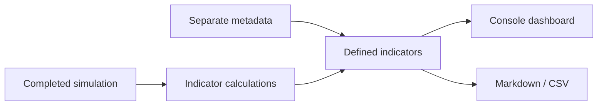
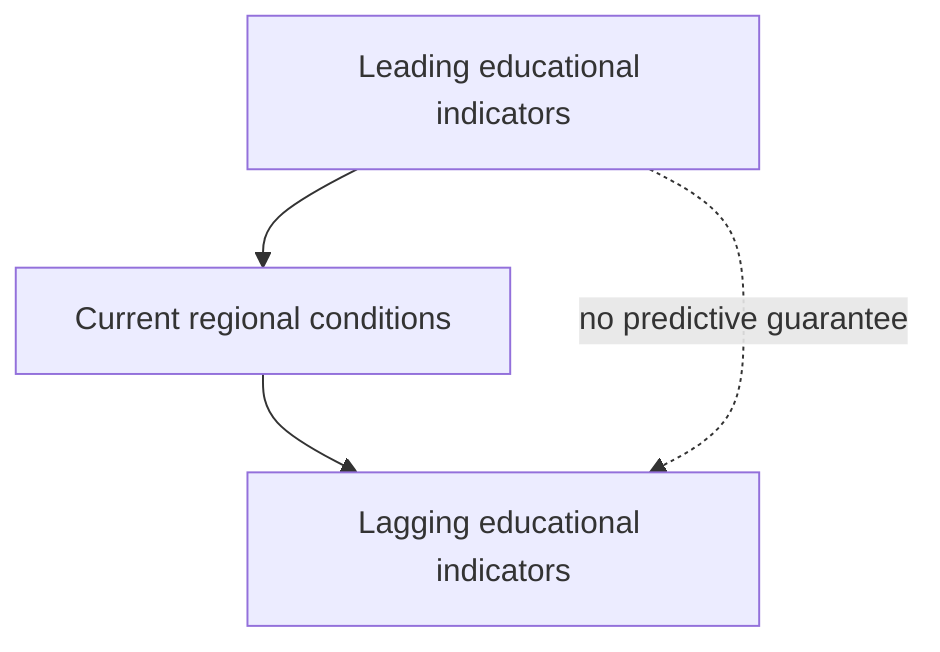
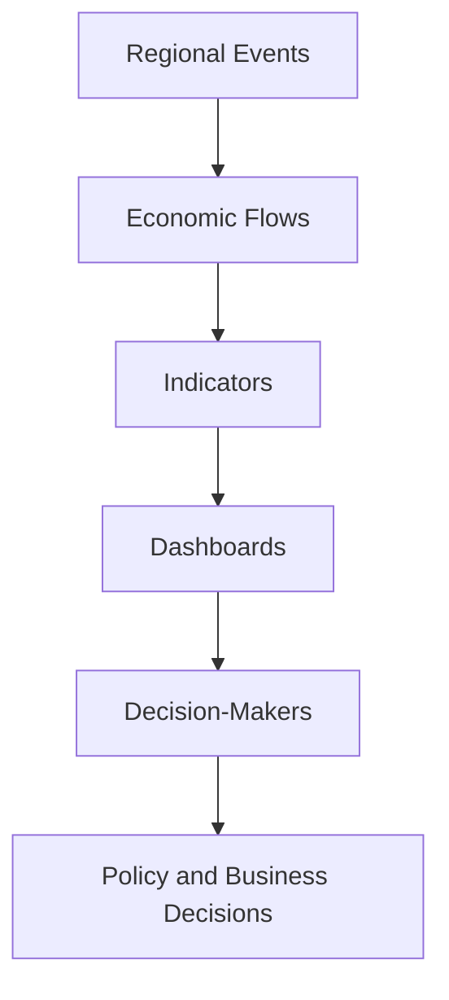

# Chapter 15 — Regional Data, Indicators, and Dashboards

## Learning objectives

After this chapter, you can define an indicator before calculating it; distinguish units, reporting periods, and data-quality notes; create monthly and caller-supplied multi-snapshot views; distinguish leading and lagging educational indicators; compare months and scenarios; and export deterministic Markdown and CSV reports without treating a trend as a prediction.

## Narrative introduction

Decision-makers cannot manage what they cannot measure—but a number without a definition can be worse than no number. A dashboard compresses the laboratory's completed economic flows into reviewable indicators. It does not create events, change behavior, recommend policy, or forecast the next month. Understanding an indicator is as important as calculating it.

## Indicator definitions and metadata

Every implemented definition records a stable key, section, name, units, description, calculation method, monthly frequency, educational assumptions, limitations, and classification. Metadata is separate from calculation functions so reviewers can inspect meaning independently of code. Money remains integer cents until display; rates remain `Decimal`.

Examples include population (people), gross household income (USD cents), tourism reservations represented by visitor nights, employment (people), tax collections (USD cents), accessibility (ratio), and supplier reliability (ratio). Reservations, hiring plans, and permits are proxies, not direct observations.

## Dashboard design and data quality

The reusable dashboard covers Population, Households, Tourism, Businesses, Higher Education, Healthcare, Government, Housing, Workforce, Transportation, Utilities, Banking, and Supply Chains. Each row exposes its current value, unit, previous-period change, and classification where relevant. The report identifies its inputs as fictional, complete, deterministic, and not live data.

## Reporting periods and monthly history

A `MonthlySnapshot` is an immutable scenario/month record. A `Dashboard` selects the latest snapshot as current, the immediately prior supplied snapshot as previous, and retains only the snapshots explicitly supplied by its caller. Stock measures such as population should not normally be summed; flow measures such as monthly tax collections may be. The caller chooses the economically appropriate aggregation.

Months must be unique and are sorted deterministically. The CLI currently reports the completed one-month scenario, so its trend says “first reported month.” Programmatic histories can contain multiple completed results. This is historical reporting, not an annual simulation.

## Leading and lagging indicators

The teaching model labels visitor nights (reservations proxy), unfilled positions (hiring-plans proxy), and construction units (permit proxy) as **leading**. Employment, household income, and tax collections are **lagging**. These labels teach timing: they do not establish causality, statistical significance, or predictive accuracy.

## Dashboard walkthrough

Run `regional-sim dashboard show baseline`. Read the scenario and month first, then the value and unit together. Examine the trend line and classification. Finish with the data-quality statement. Use `regional-sim dashboard trace baseline` to see the interpretation chain:

The final two steps occur outside the engine. Dashboards summarize the simulation rather than drive it.

Export with `regional-sim dashboard export baseline --format markdown` for a readable table or `--format csv` for deterministic plain-text interchange. Neither export requires a database, API, spreadsheet, or visualization server.

## Comparison walkthrough

Run `regional-sim dashboard compare baseline tourism-season`. The baseline and alternative values appear beside an explicit alternative-minus-baseline change. A difference reports how two assumptions behaved; it does not claim that the alternative will occur. The same comparison function can compare snapshots from two months when histories are assembled in Python.

## Debugging laboratory: inconsistent income units

Use the safe, opt-in fixture specified in **Debugging laboratory contract** below. The fault is learner-owned and deterministic; do not edit production simulation logic.

## Interpretation questions

1. Why is a 5% reported trend not a prediction of another 5% change?
2. Which multi-snapshot indicators are flows, and which are stocks that should not be summed?
3. Why can two correctly calculated indicators still be incomparable?
4. What assumption makes visitor nights only a reservations proxy?
5. Why should a scenario difference not be read as a causal policy estimate?

## Assumptions

Reports use completed deterministic monthly results. Definitions and units are stable. Values come only from the selected fictional scenario. Money calculations use integer cents, rates use `Decimal`, and event order remains unchanged. Missing live sources are disclosed rather than imputed. Year-to-date is the sum of caller-supplied monthly flow snapshots; the subsystem does not infer missing months.

## Limitations

There is no forecasting, statistical inference, machine learning, predictive analytics, live API, SQL database, BI server, interactive visualization, long-term simulation, causal analysis, optimization, or resilience scoring. Leading/lagging classifications and proxies are educational. The small indicator set is not an official regional statistical system, and dashboard output is not advice.

## Chapter summary

Good dashboards join values to definitions, units, periods, assumptions, limitations, and quality notes. Immutable snapshots enable transparent historical trends and caller-supplied multi-snapshot summaries. Scenario comparisons reveal model differences without predicting outcomes. Deterministic console, Markdown, and CSV output turns the simulation into an inspectable decision-support laboratory while preserving the boundary between measurement and prediction.

<!-- reporting-vocabulary -->
Reporting labels, units, comparison rules, annual aggregation, missing values, and export safety are centralized in
[`Indicator reference`](../docs/indicators.md) and the canonical `regional_economy.indicators` registry.

## Debugging laboratory contract

- **Goal:** distinguish a deliberately inconsistent transaction-stage identity from its corrected form without editing the engine.
- **Launch configuration:** **Chapter 15 — Inspect Indicator Metadata**.
- **Scenario:** the bundled scenario named by this chapter's executable walkthrough; the shared helper itself uses fixed learner-owned values.
- **Breakpoint:** place a semantic breakpoint inside `inspect_stage_identity()` immediately before `StageIdentityObservation` is returned.
- **Objects to inspect:** `configured_demand`, `recorded_business_revenue`, `constrained_amount`, and `identity_holds`.
- **Expected fault:** the opt-in faulty observation records revenue plus constrained demand that does not equal configured demand.
- **Reconciliation or indicator effect:** `identity_holds` is false; normal simulation results are untouched.
- **Fix:** rerun with `faulty=False`; do not edit production allocation logic.
- **Economic meaning:** constrained or interrupted demand is neither spending nor an external outflow, so it cannot be added to recorded revenue inconsistently.
- **Verification:** run `python -m regional_economy.debug_labs` and `pytest tests/test_debug_labs.py`.

## Scenario experiment checklist

Change no more than two documented assumptions in a copied scenario. Ask: **what changed, why did it change, what did not change, and what boundary limitation remains?** Separate modeled results from recommendations and identify who benefits, who bears a constraint, and whether each quantity is a flow, stock, or unmet amount.
