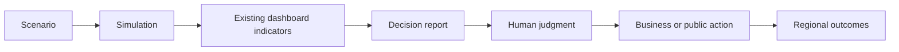
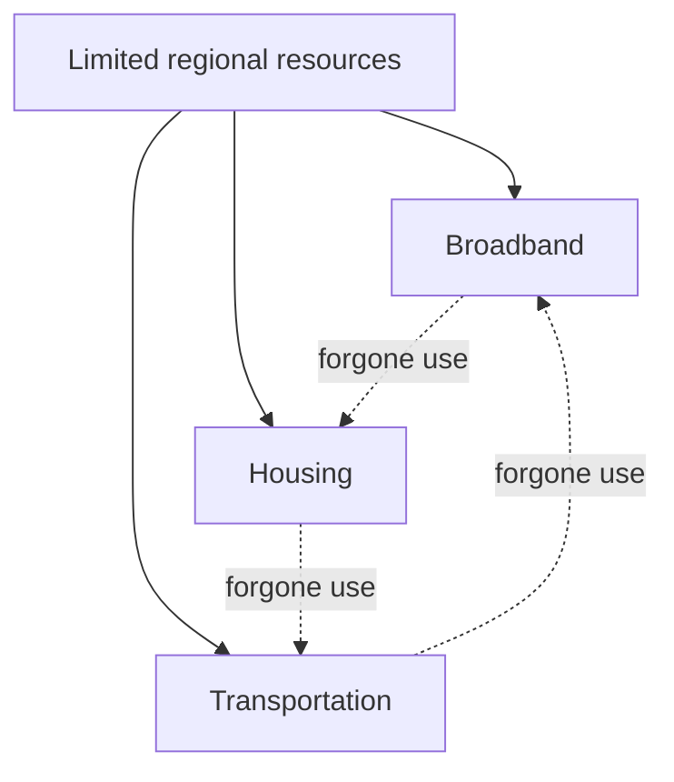

# Chapter 16 — Business and Public Decision Making

## Learning objectives

After this chapter, you can distinguish decision support from prediction; construct business and public scenario reports from dashboard indicators; identify assumptions, benefits, tradeoffs, limitations, unanswered questions, and opportunity costs; compare alternatives without ranking them; and diagnose inconsistent reporting periods.

## Introduction: reasonable alternatives

Regional leaders rarely choose between an obvious good and an obvious bad. A business may preserve liquidity, train workers, source locally, or add capacity. A public organization may improve transportation, parks, broadband, housing, or workforce services. Each is reasonable under some values and constraints. This laboratory clarifies modeled consequences; it does not determine the correct action.

Decision support asks **“what differs under these explicit assumptions?”** Prediction asks **“what will happen?”** Chapter 16 does only the former. Its one-month scenarios are deterministic educational comparisons, not causal estimates, forecasts, optimization, or advice.



## The reusable decision report

Every report names the scenario and common reporting month, assumptions, affected dashboard indicators, possible benefits, tradeoffs and opportunity cost, limitations, and unanswered questions. It reads indicator values from Chapter 15's dashboard definitions rather than recalculating them. The deterministic “scenario score” merely counts changed referenced indicators; it is neither a quality score nor a rank.

```bash
regional-sim evaluate-business expansion
regional-sim evaluate-public broadband
regional-sim compare-decisions expansion broadband
regional-sim explain-decisions
regional-sim decision-trace broadband
```

## Business decisions

The catalog covers another location, capacity expansion, delayed expansion, training, and local sourcing. Reports bring together demand and hiring signals, employment, housing/construction pressure, transportation and utility use, available credit, and supplier reliability. Financial capacity is simplified; it is not a loan offer, valuation, GAAP statement, or multi-year projection.

### Walkthrough: expansion

1. Run `regional-sim evaluate-business expansion`.
2. Confirm that the scenario is `downtown-expansion` and the comparator is `baseline` in month 1.
3. Read assumptions before changes. A changed hiring indicator is an output of this configured scenario, not a forecast.
4. Inspect benefits alongside capacity and housing tradeoffs.
5. Answer the unanswered questions with organizational priorities and better evidence; do not treat the report as a recommendation.

## Public decisions

The public catalog covers transportation, parks, workforce programs, broadband, affordable housing, and tourism marketing. Reports summarize regional activity, service/infrastructure capacity, housing construction as an affordability-pressure signal, and educational assumptions. They do not score politics, model voting, or rank policy.

### Walkthrough: broadband

Run `regional-sim evaluate-public broadband`. The broadband-upgrade scenario uses the dashboard's infrastructure reliability and other existing monthly indicators. An unchanged indicator is useful evidence about model scope, not proof of no real-world effect. Tourism marketing similarly uses a demand scenario but explicitly does not claim that marketing caused demand.

## Opportunity cost

Choosing one use of limited staff, capital, land, or budget generally means forgoing another. `compare-decisions` states both directions of that choice. It does not invent dollar values for time, access, affordability, reliability, or learning where the simulation supplies none.



Different organizations can value access, affordability, liquidity, service capacity, or employment differently. A transparent report preserves those differences rather than hiding them in an automated recommendation.

## Explain and trace modes

`explain-decisions` explains the prediction boundary, why assumptions drive results, why shared dashboard definitions matter, and why values differ. `decision-trace DECISION` prints the complete support chain and ends by stating that simulation supports rather than replaces human judgment.

## Debugging laboratory: crossed reporting periods

**Accidental defect:** report generation compares the baseline dashboard's month 1 with an alternative snapshot labeled month 2.

1. Add a semantic breakpoint in `decisions.create_report` on the condition checking `baseline.current.month != alternative.current.month`.
2. Inspect `baseline.current.scenario_name`, `alternative.current.scenario_name`, and both `month` values—not a fragile source line number.
3. Reproduce the defect by changing only the alternative snapshot month in a test (the chapter test uses `dataclasses.replace`).
4. Verify that generation raises `decision comparison requires matching reporting periods` instead of printing a misleading delta.
5. Correct the snapshot inputs, rerun both reports twice, and verify byte-identical output.
6. Explain the meaning: a difference between periods can reflect time as well as the alternative, so it cannot be attributed consistently to the scenario comparison.

A useful semantic breakpoint remains stable as code moves: stop when the **report-period invariant is evaluated**, then inspect the named domain values. Do not “fix” this by removing the guard.

## Interpretation questions

1. Which expansion indicators describe demand, capacity, workforce availability, and financing, and which effects remain outside the model?
2. Why can two organizations read the same broadband report and make different reasonable choices?
3. What is lost when opportunity cost is reduced to unsupported monetary values?
4. Why does a descriptive changed-indicator count not rank alternatives?
5. What additional evidence would be required before action?

## Assumptions and limitations

All alternatives use fictional YAML inputs, one deterministic simulation month, integer-cent money, `Decimal` rates, and stable event ordering. Dashboard metadata controls definitions and units. Scenario association is not causation. Aggregate outputs omit distribution, implementation risk, site selection, financing terms, public participation, environmental review, and political processes. The chapter contains no randomness, probability, forecasting, annual projection, optimization, artificial intelligence, machine learning, automated recommendation, voting, or political scoring.

## Summary

Decision support makes alternatives, assumptions, consequences, opportunity costs, and unknowns inspectable. Business and public reports reuse a consistent dashboard and deterministic simulation. Comparison informs human judgment without predicting, ranking, recommending, or replacing accountable decisions.
