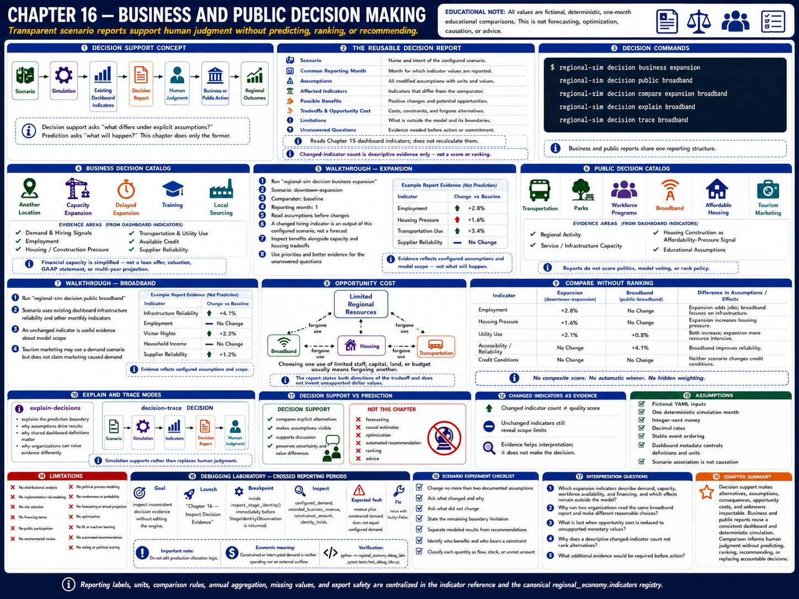
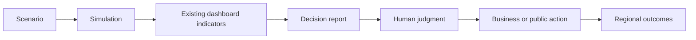
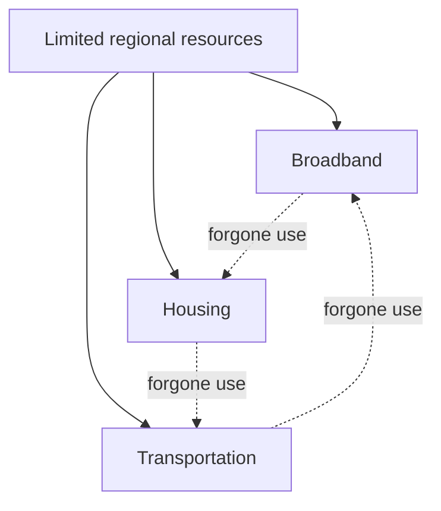

# Chapter 16 — Business and Public Decision Making



## Learning objectives

After this chapter, you can distinguish decision support from prediction; construct business and public scenario reports from dashboard indicators; identify assumptions, benefits, tradeoffs, limitations, unanswered questions, and opportunity costs; compare alternatives without ranking them; and diagnose inconsistent reporting periods.

## Introduction: reasonable alternatives

Regional leaders rarely choose between an obvious good and an obvious bad. A business may preserve liquidity, train workers, source locally, or add capacity. A public organization may improve transportation, parks, broadband, housing, or workforce services. Each is reasonable under some values and constraints. This laboratory clarifies modeled consequences; it does not determine the correct action.

Decision support asks **“what differs under these explicit assumptions?”** Prediction asks **“what will happen?”** Chapter 16 does only the former. Its one-month scenarios are deterministic educational comparisons, not causal estimates, forecasts, optimization, or advice.



## The reusable decision report

Every report names the scenario and common reporting month, assumptions, affected dashboard indicators, possible benefits, tradeoffs and opportunity cost, limitations, and unanswered questions. It reads indicator values from Chapter 15's dashboard definitions rather than recalculating them. The report counts changed referenced indicators only as transparent descriptive evidence; it does not produce a composite score, quality judgment, or rank.

```bash
regional-sim decision business expansion
regional-sim decision public broadband
regional-sim decision compare expansion broadband
regional-sim decision explain broadband
regional-sim decision trace broadband
```

## Business decisions

The catalog covers another location, capacity expansion, delayed expansion, training, and local sourcing. Reports bring together demand and hiring signals, employment, housing/construction pressure, transportation and utility use, available credit, and supplier reliability. Financial capacity is simplified; it is not a loan offer, valuation, GAAP statement, or multi-year projection.

### Walkthrough: expansion

1. Run `regional-sim decision business expansion`.
2. Confirm that the scenario is `downtown-expansion` and the comparator is `baseline` in month 1.
3. Read assumptions before changes. A changed hiring indicator is an output of this configured scenario, not a forecast.
4. Inspect benefits alongside capacity and housing tradeoffs.
5. Answer the unanswered questions with organizational priorities and better evidence; do not treat the report as a recommendation.

## Public decisions

The public catalog covers transportation, parks, workforce programs, broadband, affordable housing, and tourism marketing. Reports summarize regional activity, service/infrastructure capacity, housing construction as an affordability-pressure signal, and educational assumptions. They do not score politics, model voting, or rank policy.

### Walkthrough: broadband

Run `regional-sim decision public broadband`. The broadband-upgrade scenario uses the dashboard's infrastructure reliability and other existing monthly indicators. An unchanged indicator is useful evidence about model scope, not proof of no real-world effect. Tourism marketing similarly uses a demand scenario but explicitly does not claim that marketing caused demand.

## Opportunity cost

Choosing one use of limited staff, capital, land, or budget generally means forgoing another. `compare-decisions` states both directions of that choice. It does not invent dollar values for time, access, affordability, reliability, or learning where the simulation supplies none.



Different organizations can value access, affordability, liquidity, service capacity, or employment differently. A transparent report preserves those differences rather than hiding them in an automated recommendation.

## Explain and trace modes

`explain-decisions` explains the prediction boundary, why assumptions drive results, why shared dashboard definitions matter, and why values differ. `decision-trace DECISION` prints the complete support chain and ends by stating that simulation supports rather than replaces human judgment.

## Debugging laboratory: crossed reporting periods

Use the safe, opt-in fixture specified in **Debugging laboratory contract** below. The fault is learner-owned and deterministic; do not edit production simulation logic.

## Interpretation questions

1. Which expansion indicators describe demand, capacity, workforce availability, and financing, and which effects remain outside the model?
2. Why can two organizations read the same broadband report and make different reasonable choices?
3. What is lost when opportunity cost is reduced to unsupported monetary values?
4. Why does a descriptive changed-indicator count not rank alternatives?
5. What additional evidence would be required before action?

## Assumptions and limitations

All alternatives use fictional YAML inputs, one deterministic simulation month, integer-cent money, `Decimal` rates, and stable event ordering. Dashboard metadata controls definitions and units. Scenario association is not causation. Aggregate outputs omit distribution, implementation risk, site selection, financing terms, public participation, environmental review, and political processes. The chapter contains no randomness, probability, forecasting, annual projection, optimization, artificial intelligence, machine learning, automated recommendation, voting, or political scoring.

## Summary

Decision support makes alternatives, assumptions, consequences, opportunity costs, and unknowns inspectable. Business and public reports reuse a consistent dashboard and deterministic simulation. Comparison informs human judgment without predicting, ranking, recommending, or replacing accountable decisions.

<!-- reporting-vocabulary -->
Reporting labels, units, comparison rules, annual aggregation, missing values, and export safety are centralized in
[`Indicator reference`](../docs/indicators.md) and the canonical `regional_economy.indicators` registry.

## Debugging laboratory contract

- **Goal:** distinguish a deliberately inconsistent transaction-stage identity from its corrected form without editing the engine.
- **Launch configuration:** **Chapter 16 — Inspect Decision Evidence**.
- **Scenario:** the bundled scenario named by this chapter's executable walkthrough; the shared helper itself uses fixed learner-owned values.
- **Breakpoint:** place a semantic breakpoint inside `inspect_stage_identity()` immediately before `StageIdentityObservation` is returned.
- **Objects to inspect:** `configured_demand`, `recorded_business_revenue`, `constrained_amount`, and `identity_holds`.
- **Expected fault:** the opt-in faulty observation records revenue plus constrained demand that does not equal configured demand.
- **Reconciliation or indicator effect:** `identity_holds` is false; normal simulation results are untouched.
- **Fix:** rerun with `faulty=False`; do not edit production allocation logic.
- **Economic meaning:** constrained or interrupted demand is neither spending nor an external outflow, so it cannot be added to recorded revenue inconsistently.
- **Verification:** run `python -m regional_economy.debug_labs` and `pytest tests/test_debug_labs.py`.

## Scenario experiment checklist

Change no more than two documented assumptions in a copied scenario. Ask: **what changed, why did it change, what did not change, and what boundary limitation remains?** Separate modeled results from recommendations and identify who benefits, who bears a constraint, and whether each quantity is a flow, stock, or unmet amount.
