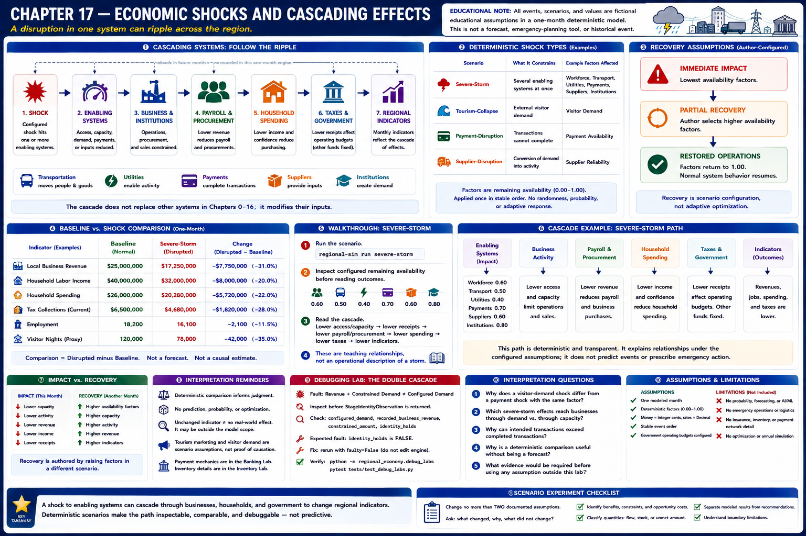
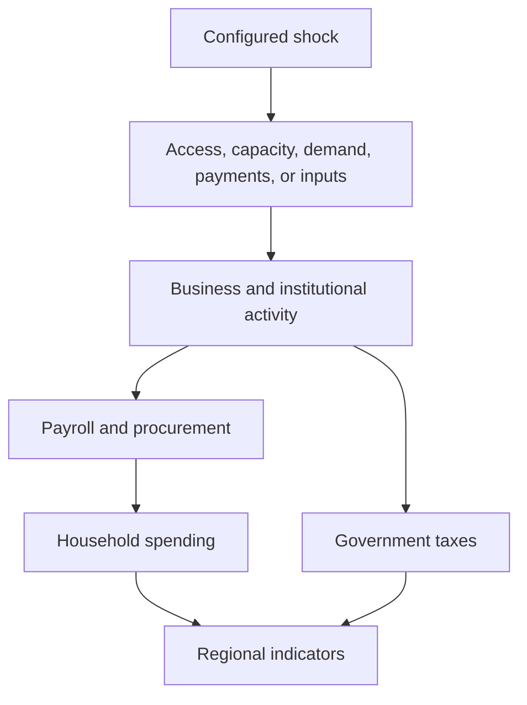
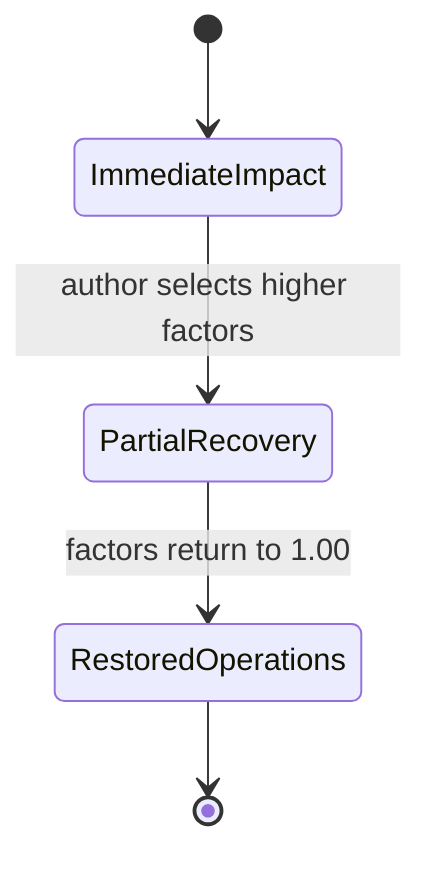

# Chapter 17 — Economic Shocks and Cascading Effects



## Learning objectives

After this chapter, you can configure a deterministic shock, follow a cascade across connected systems, compare normal and disrupted months, distinguish impact from recovery, reconcile the results, and explain why the model is educational rather than predictive.

## Narrative introduction

A regional economy is a system of systems. A utility constraint does not remain inside a utility indicator: it can limit business operations, receipts, payroll, household purchasing, and tax collections. Chapter 17 makes those links visible. Its fictional events are neither forecasts nor emergency-planning tools and do not represent a historical storm or outage.

## Cascading systems



The arrows are explicit multiplications applied once in stable engine order. Transportation connects commuters, visitors, and freight; utilities enable activity; banks complete payments; suppliers enable production; institutions create procurement demand. The cascade does not replace those Chapter 0–16 systems—it modifies their inputs.

## Deterministic shocks

A `shock` declares a label, recovery stage, affected sectors, and remaining-availability factors from zero through one. Supported factors cover visitor demand, workforce availability, transportation accessibility, utility capacity, payment availability, supplier reliability, and institutional activity. Decimal rates and integer-cent multiplication preserve reproducibility. No random draw, probability, forecast, optimizer, or adaptive response exists.

The four scenarios emphasize different paths:

* `severe-storm` constrains several enabling systems at immediate impact;
* `tourism-collapse` reduces external visitor demand during partial recovery;
* `payment-disruption` interrupts otherwise intended transactions;
* `supplier-disruption` constrains the conversion of demand into business activity.

## Recovery assumptions

Recovery is scenario configuration, not adaptive optimization. `immediate impact`, `partial recovery`, and `restored operations` describe the selected assumptions. Authors represent recovery by raising availability factors in another scenario. A restored factor of `1.00` leaves normal system behavior unchanged. The engine does not infer repair schedules, emergency action, or behavioral adaptation.



## Baseline walkthrough

Run `regional-sim run baseline`. It has no active shock. Record local activity, business revenue, household spending, and taxes. Then run `regional-sim compare baseline severe-storm`. Comparison changes are disrupted minus baseline and retain the ordinary reconciliation checks.

## Severe-storm walkthrough

Run:

```console
regional-sim run severe-storm
regional-sim report shock severe-storm
regional-sim report cascade severe-storm
regional-sim dashboard show severe-storm
```

Inspect configured remaining availability before reading outcomes. Reduced workforce availability scales current household labor income; transport affects commuter, visitor, and freight access; utility capacity constrains activity; payment availability constrains completed transactions; and supplier reliability constrains realized revenue. Lower receipts then reduce allocated payroll and taxes. This is a teaching sequence, not an operational description of a storm.

## Debugging laboratory — the double cascade

Use the safe, opt-in fixture specified in **Debugging laboratory contract** below. The fault is learner-owned and deterministic; do not edit production simulation logic.

## Interpretation questions

1. Why does a visitor-demand shock differ from a payment shock with the same numerical factor?
2. Which severe-storm effects reach businesses through demand, and which constrain capacity?
3. Why can intended transactions exceed completed transactions?
4. Why is a deterministic comparison useful without being a forecast?
5. What evidence would be required before using any assumption outside this laboratory?

## Assumptions

All events last one modeled month. Factors mean remaining availability and are applied once. Effects combine multiplicatively in stable order. Household income responds directly to workforce availability; business payroll responds to realized revenue. Government operating budgets remain configured even as current tax receipts change. Recovery stages are labels paired with authored factors. Money uses integer cents and rates use `Decimal`.

## Limitations

The framework omits probability, weather and epidemiology, emergency operations, disaster logistics, insurance, detailed payment processing, inventory synchronization, forecasting, machine learning, optimization, and an integrated annual simulation. Payment mechanics belong in the **Digital Banking Systems Laboratory**; detailed inventory synchronization belongs in the **Inventory Synchronization Laboratory**. These are conceptual links only, with no runtime dependency.

## Chapter summary

Interconnection turns a subsystem disruption into a regional cascade. Explicit deterministic factors make the path inspectable, comparable, debuggable, and reproducible. The results explain relationships under fictional assumptions; they do not predict events or prescribe emergency action.

## Debugging laboratory contract

- **Goal:** distinguish a deliberately inconsistent transaction-stage identity from its corrected form without editing the engine.
- **Launch configuration:** **Chapter 17 — Inspect Shock Stage**.
- **Scenario:** the bundled scenario named by this chapter's executable walkthrough; the shared helper itself uses fixed learner-owned values.
- **Breakpoint:** place a semantic breakpoint inside `inspect_stage_identity()` immediately before `StageIdentityObservation` is returned.
- **Objects to inspect:** `configured_demand`, `recorded_business_revenue`, `constrained_amount`, and `identity_holds`.
- **Expected fault:** the opt-in faulty observation records revenue plus constrained demand that does not equal configured demand.
- **Reconciliation or indicator effect:** `identity_holds` is false; normal simulation results are untouched.
- **Fix:** rerun with `faulty=False`; do not edit production allocation logic.
- **Economic meaning:** constrained or interrupted demand is neither spending nor an external outflow, so it cannot be added to recorded revenue inconsistently.
- **Verification:** run `python -m regional_economy.debug_labs` and `pytest tests/test_debug_labs.py`.

## Scenario experiment checklist

Change no more than two documented assumptions in a copied scenario. Ask: **what changed, why did it change, what did not change, and what boundary limitation remains?** Separate modeled results from recommendations and identify who benefits, who bears a constraint, and whether each quantity is a flow, stock, or unmet amount.
