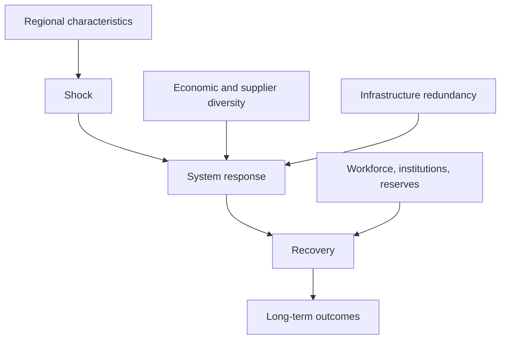

# Chapter 18 — Regional Resilience and Adaptation

## Learning objectives

After this laboratory you can distinguish resilience from growth; interpret economic diversity, redundancy, and adaptive capacity; compare deterministic recovery paths; and audit a composite without treating it as an official rating.

## Narrative introduction

A disruption can reduce activity even in a resilient fictional region. Resilience is not the absence of disruption: it is the ability to absorb a shock, continue essential functions, adapt, and recover. A tourism-dependent region and a diversified economy can face the same interruption yet follow different paths because their workers, suppliers, infrastructure, institutions, and financial reserves interact differently.

## Concepts and framework

The reusable framework stores seven `Decimal` rates: economic diversity, infrastructure redundancy, workforce adaptability, institutional capacity, supplier diversity, financial capacity, and recovery readiness. Retraining capacity is a whole-person count and reserve funding is integer cents. All are authored scenario assumptions, not inferred or predicted ratings.

**Diversity** reduces reliance on one sector or supplier, but does not guarantee recovery. **Redundancy** provides alternate capacity; it can look inefficient in an undisturbed month but preserve essential functions. **Adaptive capacity** combines retraining, supplier alternatives, reserves, and coordination. The displayed composite is an equal-weight teaching summary. Always inspect its components.




## Scenario walkthroughs

Run:

```console
regional-sim diversified-region
regional-sim tourism-dependent
regional-sim resilient-infrastructure
regional-sim limited-redundancy
regional-sim resilience-report baseline
regional-sim compare baseline diversified-region
regional-sim compare-resilience tourism-dependent diversified-region
regional-sim resilience-trace resilient-infrastructure
regional-sim resilience-explain
```

`diversified-region` combines sector and supplier variety. `tourism-dependent` exposes concentration. `resilient-infrastructure` emphasizes alternate capacity and coordination. `limited-redundancy` shows that reasonable diversity cannot substitute for every infrastructure dependency. Recovery periods are a deterministic illustration derived from the configured summary, not dates or forecasts.

## Debugging laboratory — the indicator counted twice

1. Set a **semantic breakpoint** in `build_resilience_report` on the line that sums `values`—the moment indicator aggregation becomes a composite.
2. Run `regional-sim resilience-report diversified-region`.
3. Inspect `values`: seven names must be unique. Record the sum and divisor.
4. Introduce the bug locally by appending `economic_diversity` to `values` while retaining (or incorrectly changing) the divisor. Observe the inflated summary and changed illustrative recovery periods.
5. Remove the duplicate and run `pytest tests/test_resilience.py`. Confirm the unique-name assertion and expected report.
6. Explain why even the corrected equal-weight composite hides trade-offs and must accompany its components.

This breakpoint is semantic because it stops where the economic meaning changes—not merely at program entry.

## Interpretation questions

1. Why can a fast-growing, concentrated region be less resilient than a slower-growing diverse region?
2. When is spare capacity valuable despite reducing apparent efficiency?
3. Which two indicator profiles could share a composite but imply different vulnerabilities?
4. How do supplier options, payment continuity, and workforce retraining interact?

## Assumptions

The regions are fictional. Rates are bounded deterministic scenario characteristics. Every indicator contributes once and equally to the optional summary. The illustrative path starts from twelve periods and applies no probabilities. Scenario assumptions—not observed evidence—drive results.

## Limitations

This chapter is not an official resilience rating, prediction, risk probability, emergency-response plan, disaster operation, insurance model, optimization, annual simulation, or machine-learning system. It does not represent real jurisdictions and does not prescribe investments.

## Connections to Garcia Systems Laboratories

Payment resilience complements the **Digital Banking Systems Laboratory**; supplier alternatives complement the **Inventory Synchronization Laboratory**; pricing adaptability complements the **Marketplace Pricing and Solutions Engineering Lab**. These are conceptual educational connections only—no data, rankings, or operational recommendations cross between laboratories.

## Chapter summary

Resilience emerges from interacting economic, workforce, infrastructure, supplier, institutional, and financial systems. Diversity creates alternatives, redundancy preserves functions, and adaptive capacity supports change. Compare components and paths; never mistake the composite for certainty.
