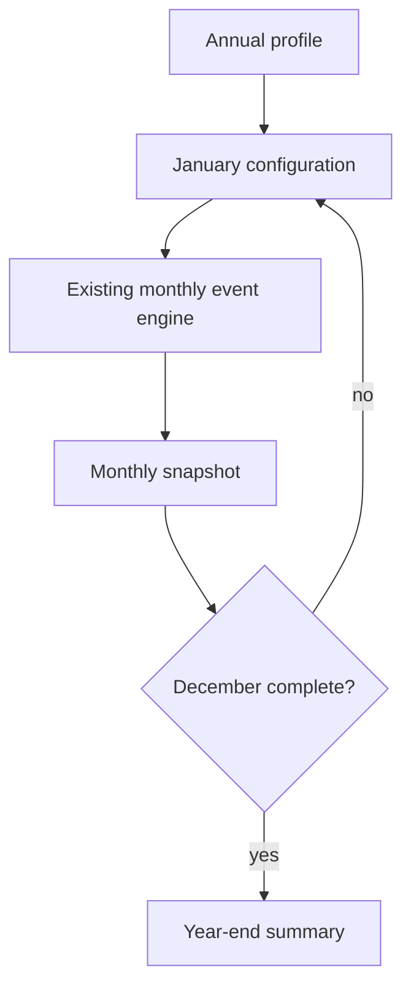
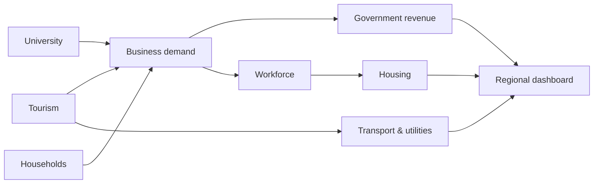

# Chapter 19 — A Year in the Regional Economy

## Learning objectives

After this chapter, you can run a twelve-month deterministic scenario, distinguish stocks and flows in an annual summary, explain seasonal interactions, compare two years, and diagnose a duplicated month.

## Narrative introduction

A region changes even when no shock occurs. Summer visitors fill rooms, the academic calendar changes student activity, household demand reaches businesses, taxes follow transactions, and infrastructure carries the resulting load. Chapter 19 is the first capstone: it **composes** Chapters 0–18 rather than inventing another economic model. Every value remains fictional and educational.

## Annual simulation and seasonality

`run_annual_scenario` calls the existing monthly engine exactly twelve times in calendar order. The annual layer selects a configured Chapter 4 tourism season and Chapter 5 academic season, sets the month counter, and retains each immutable result and dashboard snapshot. `normal-year`, `strong-tourism-year`, and `weak-tourism-year` apply transparent visitor-demand factors of 1.00, 1.20, and 0.80. They are scenarios, not forecasts.



Monthly flow values—income, tourism spending, and government revenue—are summed. Stock or ratio indicators—employment, housing occupancy, transportation and utility utilization, and resilience—are averaged. Integer cents and `Decimal` rates preserve the earlier chapters' rules.

## Integrated systems



The dashboard snapshots preserve household, tourism, university, healthcare, government, workforce, transport, utility, banking, supply-chain, and resilience indicators. This reinforces concepts shared across the Garcia Systems laboratories while leaving specialized operations—inventory synchronization, routing, finance, or infrastructure engineering—to their respective laboratories.

## Annual walkthrough

Run:

```console
regional-sim annual baseline
regional-sim annual-report baseline
regional-sim annual strong-tourism-year
regional-sim annual weak-tourism-year
regional-sim compare-years baseline strong-tourism-year
regional-sim annual-explain
regional-sim annual-trace baseline
```

Read the timeline as **Month → major events → key changes → dashboard**. Compare January's winter tourism with July's summer peak, then inspect the year-end totals. An annual average is useful, but it can conceal a capacity peak or seasonal trough.

## Debugging laboratory — the month that happened twice

**Fault:** copy the `results.append(run_scenario(scenario))` line in the annual loop. **Semantic breakpoint:** pause on `run_scenario(scenario)` in `run_annual_scenario`; inspect `index`, `scenario.region.current_simulation_month`, `len(results)`, and the next result's `month`. Continue twelve times and verify the invariant `tuple(month.month for month in results) == tuple(range(1, 13))`.

The duplicate creates thirteen results or a repeated month and overstates every summed annual flow. Remove the duplicate, rerun `pytest tests/test_annual.py`, and reconcile the annual household-income total with the sum of its twelve monthly values. Repeated processing is not harmless reporting duplication: it records economic activity twice.

## Interpretation questions

1. Which monthly peak is hidden most by the tourism annual total?
2. Why are revenues summed while occupancy is averaged?
3. How does the academic summer affect student population and business demand?
4. Why does a scenario difference not constitute a prediction?

## Assumptions and limitations

Months execute sequentially and exactly once. Seasonal mappings and annual tourism factors are explicit constants. The model has no random events, forecasting, optimization, machine learning, price response, inventories, migration, customizable regions, user-defined economies, or multi-year state transitions. Monthly subsystem implementations retain their own documented simplifications.

## Chapter summary

A regional economy is a time-ordered system. Twelve reproducible monthly runs reveal variation that a single annual average hides. Snapshots explain when changes occurred; annual summaries reconcile what accumulated; comparisons describe consequences of explicit assumptions without predicting the future.
