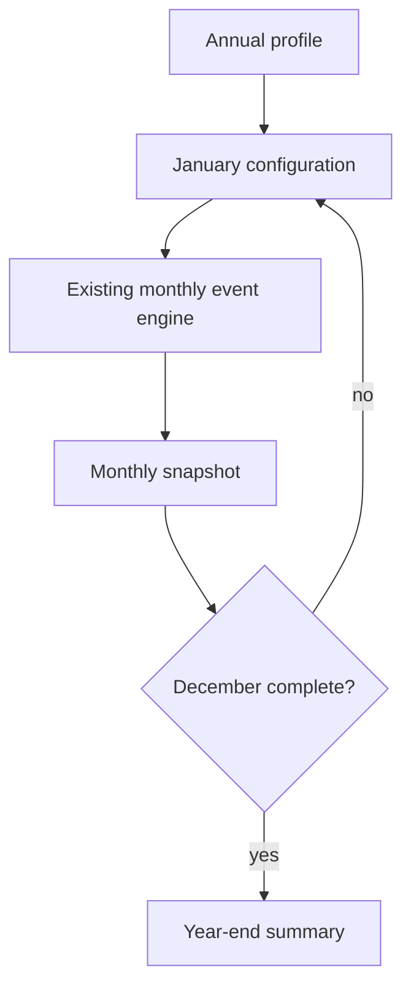
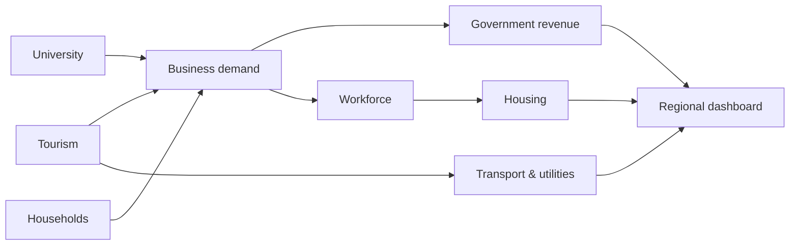

# Chapter 19 — A Year in the Regional Economy

## Learning objectives

After this chapter, you can run a twelve-month deterministic scenario, distinguish stocks and flows in an annual summary, explain seasonal interactions, compare two years, and diagnose a duplicated month.

## Narrative introduction

A region changes even when no shock occurs. Summer visitors fill rooms, the academic calendar changes student activity, household demand reaches businesses, taxes follow transactions, and infrastructure carries the resulting load. Chapter 19 is the first capstone: it **composes** Chapters 0–18 rather than inventing another economic model. Every value remains fictional and educational.

## Annual simulation and seasonality

`run_annual_scenario` calls the existing monthly engine exactly twelve times in calendar order. The annual layer selects a configured Chapter 4 tourism season and Chapter 5 academic season, sets the month counter, and retains each immutable result and dashboard snapshot. `normal-year`, `strong-tourism-year`, and `weak-tourism-year` apply transparent visitor-demand factors of 1.00, 1.20, and 0.80. They are scenarios, not forecasts.



This is a **deterministic twelve-month seasonal simulation**, not one continuously stateful year. Each month is independently derived from the baseline (or custom-file) configuration plus its configured tourism factor, academic season, and month index. The annual summary sums registered flow indicators and averages the implemented employment, utilization, and educational resilience indicators. Monthly snapshots retain each month's values; the implementation does not select month-end stocks for the current summary. No reserve, deposit, savings, inventory, or other balance carries from one monthly run into the next. Integer cents and `Decimal` rates preserve the earlier chapters' rules.

## Integrated systems



The dashboard snapshots preserve household, tourism, university, healthcare, government, workforce, transport, utility, banking, supply-chain, and resilience indicators. This reinforces concepts shared across the Garcia Systems laboratories while leaving specialized operations—inventory synchronization, routing, finance, or infrastructure engineering—to their respective laboratories.

## Annual walkthrough

Run:

```console
regional-sim annual run normal-year
regional-sim annual report normal-year
regional-sim annual run strong-tourism-year
regional-sim annual run weak-tourism-year
regional-sim annual compare normal-year strong-tourism-year
regional-sim annual explain normal-year
regional-sim annual trace normal-year
```

Read the timeline as **Month → major events → key changes → dashboard**. Compare January's winter tourism with July's summer peak, then inspect the year-end totals. An annual average is useful, but it can conceal a capacity peak or seasonal trough.

## Debugging laboratory — the month that happened twice

Use the safe, opt-in fixture specified in **Debugging laboratory contract** below. The fault is learner-owned and deterministic; do not edit production simulation logic.

## Interpretation questions

1. Which monthly peak is hidden most by the tourism annual total?
2. Why are revenues summed while occupancy is averaged?
3. How does the academic summer affect student population and business demand?
4. Why does a scenario difference not constitute a prediction?

## Assumptions and limitations

Months are invoked in calendar order and exactly once, but their economic stocks are not carried forward. Seasonal mappings and annual tourism factors are explicit constants. The model has no random events, forecasting, optimization, machine learning, price response, inventories, migration, multi-year state transitions. Monthly subsystem implementations retain their own documented simplifications.

## Chapter summary

A regional economy is a time-ordered system. Twelve reproducible monthly runs reveal variation that a single annual average hides. Snapshots explain when changes occurred; annual summaries reconcile what accumulated; comparisons describe consequences of explicit assumptions without predicting the future.

## Debugging laboratory contract

- **Goal:** distinguish a deliberately inconsistent transaction-stage identity from its corrected form without editing the engine.
- **Launch configuration:** **Chapter 19 — Inspect Annual Aggregation**.
- **Scenario:** the bundled scenario named by this chapter's executable walkthrough; the shared helper itself uses fixed learner-owned values.
- **Breakpoint:** place a semantic breakpoint inside `inspect_stage_identity()` immediately before `StageIdentityObservation` is returned.
- **Objects to inspect:** `configured_demand`, `recorded_business_revenue`, `constrained_amount`, and `identity_holds`.
- **Expected fault:** the opt-in faulty observation records revenue plus constrained demand that does not equal configured demand.
- **Reconciliation or indicator effect:** `identity_holds` is false; normal simulation results are untouched.
- **Fix:** rerun with `faulty=False`; do not edit production allocation logic.
- **Economic meaning:** constrained or interrupted demand is neither spending nor an external outflow, so it cannot be added to recorded revenue inconsistently.
- **Verification:** run `python -m regional_economy.debug_labs` and `pytest tests/test_debug_labs.py`.

## Scenario experiment checklist

Change no more than two documented assumptions in a copied scenario. Ask: **what changed, why did it change, what did not change, and what boundary limitation remains?** Separate modeled results from recommendations and identify who benefits, who bears a constraint, and whether each quantity is a flow, stock, or unmet amount.
