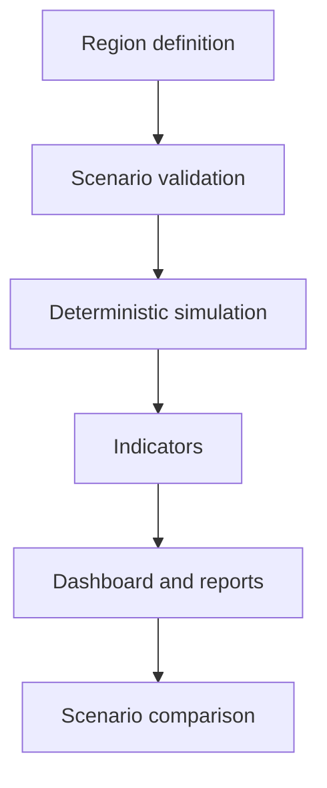
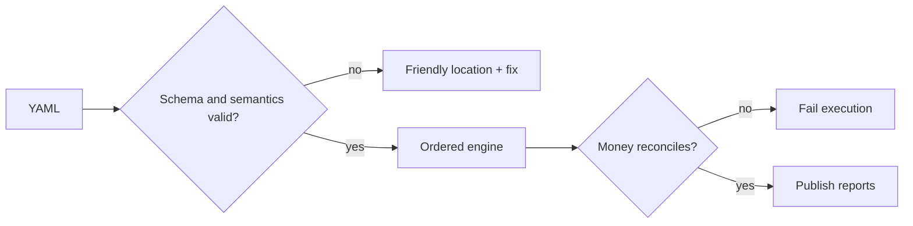

# Chapter 20 — Design Your Own Regional Economy

> Every region and value in this laboratory is fictional and educational. Results are deterministic comparisons, not forecasts or recommendations.

## Learning objectives

After this capstone you can (1) describe a region as configuration, (2) adapt a reusable template, (3) interpret friendly validation errors, (4) run the common engine, (5) compare profiles, and (6) inspect dashboards, annual summaries, decision reports, and resilience reports.

## A configurable regional system

A tourism center, university town, manufacturing community, suburban county, and diversified metropolitan region differ in assumptions—not in simulation code. Population and household composition create needs and spending; industries and institutions create employment and procurement; housing and workforce constrain participation; transportation and utilities affect accessible activity; government, banking, and suppliers route resources. A change can therefore propagate into revenue, leakage, utilization, resilience, and reporting.



## Reusable regional models and templates

`tourism-region`, `university-region`, `manufacturing-region`, and `diversified-region` are complete fictional starting points. They deliberately use the same schema and engine. The root `scenarios/` directory is the readable authoring collection; identical package-resource copies make installed commands reproducible. `regional-sim list-templates` lists capstone starters.

A configuration defines population, household cohorts, four supported local business sectors, university and healthcare institutions, housing, workforce, tourism, government departments, transportation, utilities, banking, supply chain, and resilience assumptions. Money is written as quoted decimal dollars and converted to integer cents. Rates are quoted decimals and parsed as `Decimal`.

## Validation philosophy

Validation stops before execution and reports the location, problem, and repair. It checks required sections, nonnegative counts and money, rates within zero and one, shares totaling exactly 100%, supported sectors and indicators, compatible population/employment and affordability assumptions, unique entities, and subsystem-specific capacities. Runtime reconciliation then verifies sources equal uses. The scheduler supplies stable event ordering; YAML list order never changes engine phases.



## Laboratory workflow

```console
regional-sim create-template my-region
regional-sim validate my-region.yml
regional-sim run my-region.yml
regional-sim compare my-region.yml baseline
regional-sim dashboard my-region.yml
regional-sim annual-report my-region.yml
regional-sim laboratory-explain
regional-sim laboratory-trace
```

1. Copy a template with `create-template NAME [TEMPLATE]`; existing files are never overwritten.
2. Change one explicit assumption and preserve the fictional disclaimer.
3. Validate before running. Correct every error rather than weakening checks.
4. Run the integrated laboratory report, then individual dashboard, annual, decision, or resilience commands as needed.
5. Compare with a named or file-based scenario. Change one family of assumptions when causal interpretation matters.
6. Save the YAML, command, version, and output together for reproducibility.

No region-specific Python is necessary: loader-created domain entities flow through the existing engine and generic reporters. Explain Mode connects assumptions to cross-subsystem consequences; Trace Mode prints the complete configuration-to-comparison chain.

## Walkthrough: fictional Harbor Learning Region

Create it from `university-region`, rename the file and `name`, then lower resident enrollment while increasing commuter enrollment. Validate and run it. Inspect population, student spending, transportation utilization, business revenue, tax collections, and reconciliation. Compare with the untouched template. The comparison describes the consequences of authored assumptions; it does not predict enrollment.

## Debugging laboratory: inconsistent assumptions

Copy a template to `broken-region.yml` and set `name: broken-region`. Introduce each defect separately:

* set `region.population: -1`;
* make tourism spending shares total `1.10`;
* change a local business sector to `mining`.

Run `regional-sim validate broken-region.yml`. Read the path and **Fix** clause, locate that YAML field, correct it, and validate again. Then run `regional-sim run broken-region.yml` and confirm every reconciliation says `PASS`.

**Semantic breakpoints:** pause in `load_scenario` immediately after YAML loading to inspect `raw`; pause in `_shares` before its sum check to inspect `parsed`; pause at `run_scenario` only after validation succeeds; and pause where engine events are sorted to inspect their stable `(month, phase, sequence)` meaning. Predict whether execution should begin before stepping. A validation error is correct behavior, not a simulation crash.

## Interpretation questions

1. Which external inflow sustains the region, and where does it leak?
2. Does a larger population have compatible workforce, housing, transport, and utility assumptions?
3. Which comparison differences are direct inputs, and which emerge through subsystem connections?
4. Are capacity constraints hiding demand?
5. Why does a reconciled result remain an educational model rather than a fact?
6. Could another learner reproduce the exact bytes from the same file and version?

## Assumptions and limitations

All entities are aggregates; supported business sectors remain retail, restaurants, personal services, and entertainment. Manufacturing-region is a profile expressed through the existing aggregate business/supplier framework, not a new production system. Configuration does not calibrate itself. The laboratory has no GIS, live data, GUI, probability, forecasting, optimization, machine learning, policy recommendation, or causal inference. Annual execution repeats explicit seasonal rules for one configured year rather than forecasting.

## Summary

A regional economy is a configurable system. Templates make assumptions reusable, validation protects accounting and subsystem contracts, deterministic scheduling makes results reproducible, and shared reports allow meaningful controlled comparisons. The capstone changes regions by changing YAML—not by rewriting the engine.
